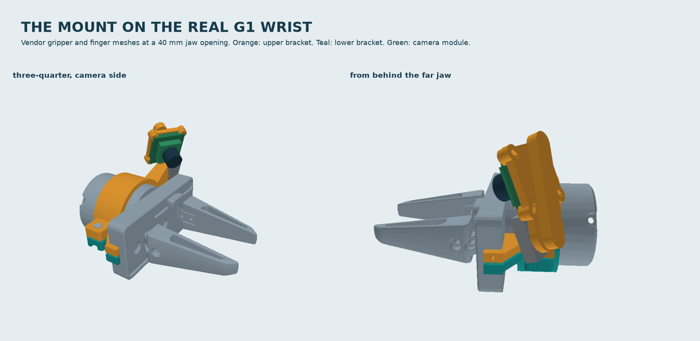
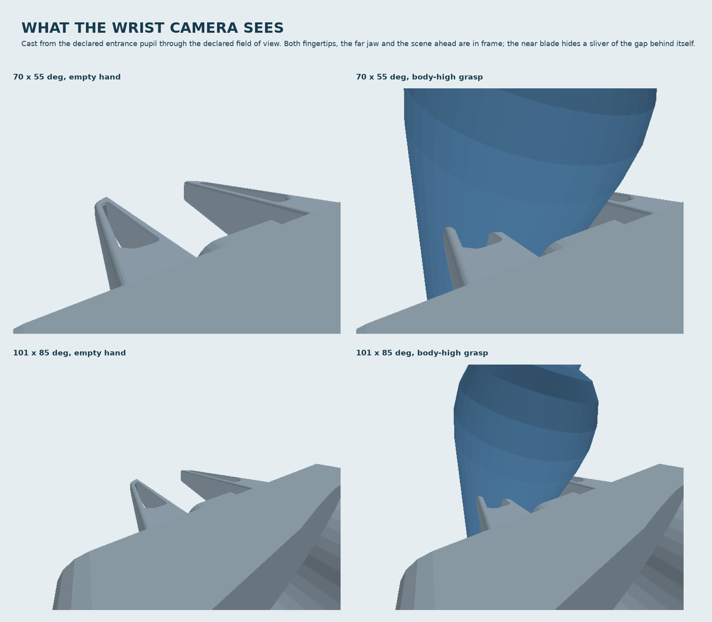
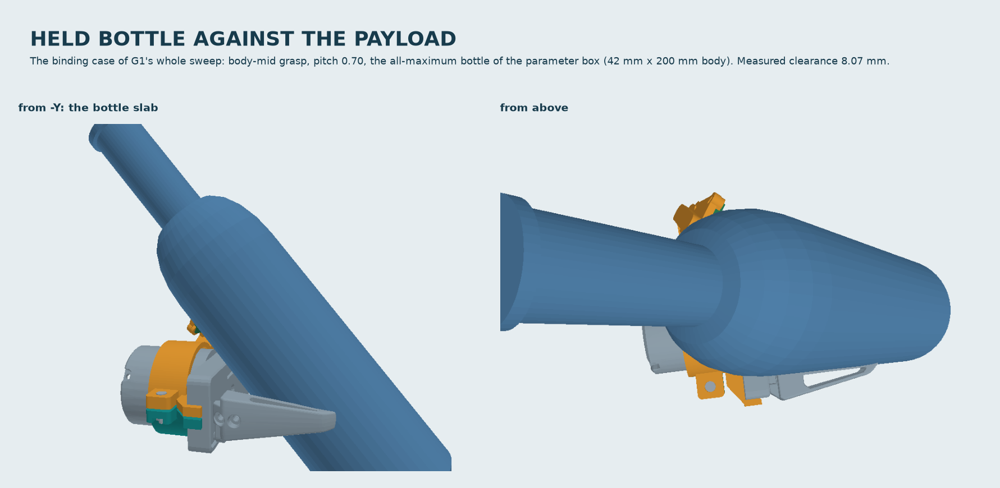
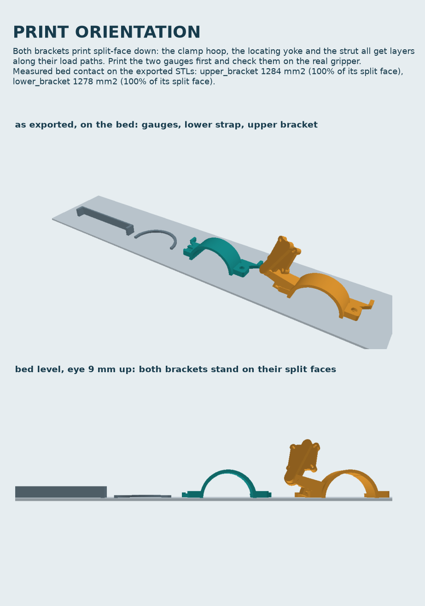

# G1 wrist-camera mount

A printed two-part bracket that clamps a 32 x 32 mm UVC board camera onto the
Galaxea A1X's G1 gripper, for wrist-camera visuomotor policies (the bottle-pour
task in `sim/`).

**Nothing here has been printed or fitted to a real gripper.** Everything below
is measured in CAD against the vendor meshes in
`ros2_ws/src/galaxea_a1xy_description`. Two fit gauges are part of the package
precisely because the vendor mesh is a simplification of the real part.



## Read this before you build it

Four things this mount does not do. They are measured, not guessed, and each one
is re-derived on every run of `verify.py`; the detail is further down.

<!-- generated: limits -->
- **At a 10 mm jaw opening the camera sees 0 % of the Z = 0 grasp zone and 52 % of the far pad.** Every block is the gripper's own near blade, not the mount; at 20 mm those two are 60 % and 100 %. Close the last millimetres of a pinch on force, not on this image.
- **On body grasps a held bottle fills 0.26-0.35 of the wrist image with the wide lens, and the bottle's mouth is never in frame** (0 of 80 grasps): it is *behind the camera plane*, so no field of view reaches it. The wrist stream is for approach and grasp; the pour itself has to be closed on the external camera, or the planner biased to neck grasps.
- **The planner cannot see these collision geoms until `sim/DATASET.md` §1b is applied.** `planner/motion.py` calls every contact between two `arm/` bodies a self-contact, and the mount compiles as `arm/wrist_camera_mount`.
- **The left hand is the recommended build, the recommendation is decided on 60 simulated episodes, and it misses v4's 64-collision reference**: 74 against the right hand's 61. The gate is the right hand, like for like with v4; the left is a disclosed miss. The harness picked the same hand on all 3 seed ranges (0-19 → left, 100-119 → left, 200-219 → left), but a range is 20 episodes, not a proof. See *Wrist roll*.
<!-- /generated -->


## What it is

Two PETG parts plus hardware. A split clamp closes on the gripper's 60 mm
housing at X = -52..-24 mm. Forward of the band, two horns reach the rail's back
face and butt it: that is the axial datum. Ears on the horns straddle the rail's
two end faces: that is the anti-rotation key. A 42 mm tapered strut carries the
camera plate outboard on +Y, low and behind the rail.

The camera is off to the side and well back **because a held bottle owns the
space above the housing.** On the pour planner's body grasps a bottle leans back
over the wrist; it is a |Y| <= 42 mm slab. Anything on a mast over the housing —
which is what the previous revision was — is inside the bottle.

**The strut lands on the plate 31 mm off the module's centre, not on it.** This
is the one thing about the layout that is not free, and the revision before this
one got it wrong. The clamp band sits inside the camera's *own forward
hemisphere* — the lens looks down and inboard, which is where the band is — so a
straight strut aimed at the plate's centre runs through the module to get there.
It did: 375 mm² of bracket inside the PCB's own footprint, and material 1 mm past
the lens's front vertex. No plate thickness or standoff height fixes that; the
required offset works out at >= 22.5 mm whatever they are. Which side is then
decided by three gates and not by taste — see `mount/params.py`, `STRUT_TIP_UV`.

<!-- generated: summary -->
|  |  |
| --- | --- |
| Camera PCB front-face centre | (-29.0, 51.0, 48.0) mm in `gripper_link` |
| Lens entrance pupil | (-19.78, 45.24, 42.93) mm |
| Optical axis | (0.7686, -0.4803, -0.4226) |
| Aim | 25 deg down, 32 deg yawed inboard, 39.77 deg total off the tool axis |
| Handedness | modelled with the camera on +Y (right hand); `upper_bracket_left.stl` mirrors it. **Build the left** — see *Wrist roll* for what it costs |
| Payload mass | 103.7 g including camera, fasteners and pigtail |
| Payload CoM | (-33.83, 27.05, 19.41) mm |
| Swept radius about the roll axis | 95.2 mm |
| Full-arm audit, 10,000 configurations | **61** (right hand, the gate) / 74 (left) |
<!-- /generated -->

## Verification

`python verify.py` runs every gate, writes `validation.json` and exits non-zero
if anything fails. It takes about 6 minutes; `--quick` skips the 10,000-
configuration arm audit and writes `validation.quick.json` instead, so a reduced
run cannot be mistaken for the record of a full one.

**Every table in this file is rendered from `validation.json`,
`sim/validation.json`, `camera_spec.json` and `collision/payload.json` by
`render_readme.py`; the prose around the tables is typed, and
`render_readme.py` does not check it.** Blocks between
`<!-- generated: ... -->` markers are that script's output — 18 of them, and
every table, gate count and measured figure that carries an argument lives in
one; `python render_readme.py` exits non-zero if any of them disagrees with the
files, and `--write` regenerates them. That is possible because every sampler is
seeded (`params.SAMPLE_SEED`, `BOTTLE_SEED`, `ARM_AUDIT_SEED`), so two runs of
`verify.py` produce byte-identical files. Where you see a number in a sentence
rather than a table, check it against the file — the last review found three
that were wrong, and the paragraphs that carried them are generated blocks now.

### Which command writes, which only checks

| Command | Writes | Checks |
| --- | --- | --- |
| `python verify.py` | `validation.json`, `stl/`, `step/`, `collision/`, `camera_spec.json`, `mount_on_gripper.glb` | every gate |
| `python verify.py --check` | nothing | every gate, **and** that the tracked files match what this run produces |
| `python -m mount.export` | the same files, minus `validation.json` | nothing |
| `python -m mount.export --check` | nothing | that the 17 exported files match |
| `python -m mount.render` | the four README images | nothing |
| `python sim/test_wrist_camera.py --json sim/validation.json` | `sim/validation.json`, `sim/renders/` | the simulator checks, over every `--seed-ranges` range |
| `... --check` | nothing | that `sim/validation.json` and every committed render match |
| `python render_readme.py` | nothing | that this file agrees with those two JSON files |
| `python render_readme.py --write` | `README.md`'s generated blocks | nothing |
| `python sim/make_meshes.py` | `sim/meshes/*.stl` | nothing |

Every one of those commands runs in a plain copy of this directory, with no git
history: `--check` used to exit 1 outside a checkout, and a write run outside one
silently deleted the v4 comparison from the README. `mount/v4ref.py` measures v4's
swept radius with `git show c80b163:...` where the history is there and reads it
back from the tracked `v4_reference.json` where it is not, and the block it
returns is the same either way. The sim commands need the two sim trees, and
nothing else needs anything outside this directory except
`ros2_ws/src/galaxea_a1xy_description`.

STEP export is deterministic: the OCC header's wall-clock `FILE_NAME` timestamp
is normalised to a constant (`export.STEP_EPOCH`), so `--check` is a real diff.
`assembly_right_hand.step` carries no colours — they were written as literal
sRGB triples and came back out of OCC's own XCAF reader as (0.71, 0.30, 0.03)
and (0.01, 0.26, 0.26), a colour-space conversion applied on one side of the
round trip only, so the 300 style entities said nothing reliable. The two bodies
are named `upper` and `lower`; the renders carry the colours.

<!-- generated: gates -->
| Gate | Threshold | Measured |  |
| --- | --- | --- | --- |
| vendor meshes still match `params.py` | every G1 dimension | **11 of 11** within 0.02 mm | pass |
| G1 bottle collisions | `0` | **0** | pass |
| G1 bottle clearance | `>= 4.0` | **8.07** | pass |
| G1 payload vs gripper and finger meshes | `>= 4.0` | **5** | pass |
| G1 locating features vs the finger meshes | `>= 4.0` | **5.4** | pass |
| G1 payload vs arm links 3-6 over the full wrist range | `>= 10.0` | **10.13** | pass |
| G2'a both blade tips visible at every opening | `all visible` | **all visible** | pass |
| G2'b object zone above the blades | `0` | **0** | pass |
| G2'c far jaw visible, openings >= 20 mm | `>= 0.9` | **1** | pass |
| G2'd Z=0 grasp zone visible, openings >= 40 mm | `>= 0.6` | **0.867** | pass |
| G3 forward point and fingertips in frame (recommended_wide, 101.4 x 85 deg) | `both in frame` | **margin 25.16 deg on the gated targets (19.15 deg including the jaw-100 extras)** | pass |
| G3 forward point and fingertips in frame (alternative_standard, 69.5 x 55 deg) | `both in frame` | **margin 9.34 deg on the gated targets (3.22 deg including the jaw-100 extras)** | pass |
| G3 camera pitch below the tool axis | `both in 25.0..50.0 deg` | **25.0 deg below the axis, 39.77 deg off it** | pass |
| G4 positive axial stop and anti-rotation key | `> 300.0 mm2 and >= 4.0 mm` | **480.7 mm2 of measured stop contact, 5.4 mm to the fingers, 4.43 deg of clocking slop without the grub screw** | pass |
| G5 payload swept radius about the roll axis | `<= 100.0` | **95.2** | pass |
| G5 payload collisions in 10,000 random configurations (right hand, like for like with v4; the other hand is reported, not gated) | `< 64 (v4) on the right hand` | **61 right / 74 left** | pass |
| G7 every STL watertight, one body, on the bed and inside the build volume | `all true` | **6 files** | pass |
| G6/G7 minimum wall on every printed part | `>= 2.4 mm (less 0.05 mm of tessellation) outside the 1 declared exception(s)` | **thinnest wall 2.4 mm** | pass |
| G9a each printed half confined to its side of the split plane | `<= 0.0 mm3 outside 0 declared interlock(s)` | **upper_bracket 0.0 mm3 past 0.8, lower_bracket 0.0 mm3 past -0.8** | pass |
| G9b the two halves do not intersect when assembled | `<= 0.0 mm3` | **0.0 mm3** | pass |
| G9c no two payload solids share volume, except the declared pairs | `every overlap declared in design.DECLARED_OVERLAPS and under its bound, over all 10 payload parts` | **1 intersecting pair(s) of 45 over 10 parts, 1 declared** | pass |
| G9d every bolt, nut, dowel and camera screw fits, sits in a real hole and can be got in | `0 mm3 of interference, >= 3.0 mm of hole, nothing in the way of any head or nut, and >= 8.0 mm of thread where a joint is tapped` | **8 fasteners: worst interference 0.0 mm3, least hole 4.2 mm, most material in an insertion path 0.0 mm3, least tapped thread 10.4 mm** | pass |
| G9e each bracket's exported print pose rests on its split face | `>= 60% of the split face on the bed` | **upper_bracket_right 100% of 1284.5 mm2 (lowest Z 0.0), upper_bracket_left 100% of 1284.5 mm2 (lowest Z 0.0), lower_bracket 100% of 1277.9 mm2 (lowest Z 0.0)** | pass |
| G9f the joint closes onto the liner: nothing rigid spans the ears | `<= 0.0 mm3` | **0.0 mm3 with the ears closed from 1.6 to 1.0 mm (10 mm pin in 9.2 mm of hole, 0.1 mm spare each end)** | pass |
| G9g the native left-hand build is the mirror of the right-hand one | `<= 0.0 mm3 in both directions` | **upper_bracket 0.0/0.0 mm3 either way, lower_bracket 0.0/0.0 mm3 either way** | pass |
| G9h overhang that is not the bore arch and has nothing under it | `<= 500.0 mm2 on any one file` | **lower_bracket.stl 1200.5 arch + 16.1 other, 16.1 mm2 with nothing below, upper_bracket_left.stl 1200.5 arch + 654.5 other, 441.0 mm2 with nothing below, upper_bracket_right.stl 1200.5 arch + 654.5 other, 441.0 mm2 with nothing below** | pass |
| G7 the bought camera module's envelope is empty of printed material | `<= 1.0 mm3` | **0.0 mm3** | pass |
| G7 plate material between each M2 slot and the plate edge | `>= 2.4` | **2.8** | pass |
| G7 both M4s can be reached with a key | `>= 40.0 mm of clear shaft` | **-Y 60.0 mm from above, +Y 60.0 mm from below** | pass |
| G7 the called-out M4 suits both joints | `0..4 mm past a nut, >= 8.0 mm of thread where tapped` | **+Y: tapped into the upper ear, driven from below, 10.4 mm of thread; -Y: steel nut, driven from above, 2.2 mm proud of the nut (one M4 x 16 suits both)** | pass |
| G7 the rail-key gauge reproduces the key it is there to check | `10.65 x 108.62` | **pocket 10.66 mm deep x 108.59 mm across** | pass |
| G6 first lateral mode | `>= 80.0` | **about 180 Hz, 2.3x the 80 Hz gate** | pass |
| collision primitives cover the payload within 1.5 mm | `0` | **0 uncovered points** | pass |
| collision primitives add no more than 25 % volume | `<= 1.25` | **1.133** | pass |
| collision primitives claim no more free space than revision 5's cover | `<= 90.0 cm3` | **78.64 cm3 over 57 primitives (rev 5: 90.8 cm3 over 25)** | pass |
| collision primitives pass G1 too | `>= 4.0` | **6.47** | pass |
| G8 webcam variant kept only if it passes G1 against a held bottle and against the gripper meshes, G3 framing and the swept radius | `DROPPED, or swept radius <= 125.0 mm and clearances >= 4.0 mm` | **DROPPED: no placement inside the 125 mm swept-radius allowance clears a held bottle by 4 mm while keeping the fingertips and the scene ahead in frame** | pass |
| top-down pick: payload above the fingertip plane | `>= 25.0` | **83.4** | pass |

38/38 gates pass.
<!-- /generated -->

### What this revision got wrong, and what its own gates missed

An independent review with held-out probes confirmed every headline result and
then found a blocker that all thirty gates had passed over: **the upper bracket
had material below the split plane.** The zip-tie lug was unioned onto the strut
*after* the strut had been clipped to the upper half, so it hung to Z = -1.94 —
111 mm³ of the upper half below the plane, 12.9 mm³ of it inside the lower strap,
and an exported STL that stood on that nub with its whole split face 2.7 mm off
the bed while the README said "prints split-face down, supports: none".

The common thread is that thirty gates measured the payload against the *robot*
and nothing measured the payload against *itself*, and that every one of them
measured the part **as modelled** rather than as assembled. Eight gates do now
(G9a-h), and looking for the same class turned up three more real defects:

| Was | Is |
| --- | --- |
| The zip-tie lug hung 2.74 mm below the split plane, into the lower strap and into the only line by which the camera-side M4's nut could reach its pocket. | The flank is chosen by two rules before preference: the whole lug above +SPLIT_GAP and behind KEEPOUT_X. `validation.json` → `ziptie_flank` records all four candidates and what each would cost. **G9a/G9b: 0 mm³ either way.** |
| *(found while fixing it)* **The camera-side M4's nut could not be fitted at all.** Its pocket opened upward through the upper ear's top face — under the strut's root, which is the same feature that made that bolt be turned over. Swept as a solid, all six straight lines out of that pocket are blocked: 1044 mm³ of strut and plate above, the tie lug and the clamp band either side in Y, the yoke's stop horn at +X, the alignment dowel 0.7 mm off the channel at -X. | That joint is an M4 **tapped into the upper ear**, 10.4 mm of engagement, 2.6 × the thread diameter. The far-side joint keeps its steel nut and gains a channel out through the ear's end face. **G9d sweeps every head, nut and pin along its insertion path.** |
| *(found while fixing it)* The M4 clearance holes were cut `-20 .. +20`, a magic number 8 mm longer than the bolt needs. On the camera side that ended the hole *inside the strut's root*, 2.2 mm under its outer surface. | `bolt_hole_span()` derives it from the called-out bolt's own reach. The 2.2 mm wall is 9.0 mm. |
| *(found while fixing it)* The nut pocket was cut 1 mm past the ear's outer face, which sliced a 0.21 mm knife edge out of the strut-to-ear blend block standing over it. | The pocket stops at the face. Thinnest wall on either bracket is back to 2.4 mm. |

A second review, also clean-room, confirmed all of that and found four more of
the same kind — all of them things a gate looked at and could not see:

| Was | Is |
| --- | --- |
| **The called-out 3 x 10 mm dowel bottomed out across the joint.** Each half held `DOWEL_DEPTH - SPLIT_GAP` = 4.2 mm of blind hole, 8.4 mm for a 10 mm pin, so the pin held the ears at the *as-modelled* 1.6 mm. The clamp has to close to 1.0 mm to reach the liner; measured in that pose the pin drove 0.60 mm into the two halves — the whole of the travel — so the bore never reached the liner and the clamp did not grip. Every G9 gate passed it, because every G9 gate measured the open pose, where the pin sits in free air in both holes. | The hole depth is derived from the pin, the closed gap and 0.2 mm of slack: **4.6 mm a side**, 9.2 mm of hole plus a 1.0 mm gap for a 10 mm pin. **G9f re-runs the assembly invariants with the halves translated onto the liner: 0.0 mm³.** |
| **One of the two dowels was never built.** `fastener_envelope` created it after the tapped joint's `continue`, so only the -Y pin existed. The symptom was a gate that shrank instead of failing: G9c reported 36 pairs of 9 parts where there are 45 of 10, 1.1 g of dowel mass sat entirely on -Y and pulled the exported CoM 0.39 mm across, and the total came out right only because `DOWEL_MASS_G` was a 4 mm pin's 1.1 g where the BOM calls out a 3 mm one. | Both pins are built, `DOWEL_MASS_G` is the 3 x 10 steel pin's **0.55 g**, and G9c now asserts the payload's own part list (`design.PAYLOAD_PART_NAMES`), so a lost part fails a gate instead of shrinking one. |
| **`payload_parts(side=-1)` was not the mirror of the right hand.** The camera plate read its image-v direction off a hard-coded sign that is only right for a +Y camera, so on the -Y frame the tongue, the spine and the M2 lugs all went the wrong way: 4470 mm³ of the native-left part was not in `mirror(right)`, and its swept radius was 106.8 mm against a 100 mm gate. Nothing shipped used that path — the STL, the sim mesh and the audit's left hand are all `design.mirrored()` — but `HANDEDNESS` invites being set to -1. | The sign comes off the frame. **G9g differences the two builds both ways: 0.0 mm³.** |
| **"Supports: none" charged the whole overhang to the bore arch.** 654 of the upper bracket's 1855 mm² is not the arch, and 441 mm² of that has nothing at all underneath it, up to 58 mm above the bed: the underside of the strut root and the camera plate cantilevering over the bolt ear. | The overhang is reported in three parts and the non-arch, nothing-below figure is the gated one (**G9h**). See *Print*. |

Four reporting defects from the same review are fixed in the prose and the
toolchain rather than in the part: the four "we tried to fix the left hand"
figures were typed and three of them were wrong (they are `checks.g5_what_if`'s
output now, rendered), "both hands see exactly the same things" is contradicted
by the package's own view census, `verify.py --check` exited 1 in any copy of
this directory without git history, and `sim/DATASET.md` carried two counts
measured on a previous revision of the bracket (`--phase filter` measures them).

The eight the *first* review found are still fixed, and still gated:

| Was | Is |
| --- | --- |
| *(found while fixing the rest)* The strut's root stands over the camera-side M4, so that bolt could not be reached with a key at all — no direction above it has 70 mm of clear shaft. | That bolt is turned over and driven from underneath; `driver_access` measures the clear shaft at both, 60 mm each. |
| *(found while fixing the rest)* Four tangential contacts in the CAD — the spine on the plate's rear plane, an M2 lug grazing the plate's corner, the pad's cap sharing a cylinder with the lug's, the strut's end coplanar with the spine's — left the upper bracket's STL non-watertight. | All four broken deliberately, and `mesh_validity` was already gating watertightness: it just had nothing to catch until the geometry changed. |
| The strut ran through the camera plate and the PCB — 375 mm² of bracket inside the board's footprint. Nothing tested the bracket against the module it carries. | The strut lands 31 mm off the module's centre and tapers to 12 x 10 mm. `G7_module_fit` measures the boolean intersection: **0.0 mm³**. |
| The M3 grub screw hole did not exist: `extrude(-8.0)` swept it entirely outside the solid, and 3.2 mm was a clearance diameter anyway. | Cut inward, 2.5 mm core for a tapped M3. It is the feature G4's clocking rests on. |
| Clocking slop quoted as 0.317°, computed with the rail's 54.16 mm Y half-width as the lever arm. The ears only touch over \|Z\| <= 7 mm. | Measured by rotating the rail's own surface into the ears' pocket: **+1.77 / -2.66°, 4.43° total, without the grub screw**. See G4 below — this is why the grub screw is not optional. |
| M2 slots broke out of the plate's chamfered corners, leaving 0.6-0.8 mm of wall, and the slot was 1.2 mm longer than a 26-30 mm pattern needs. | Slot length is the real diagonal travel; each slot's outer end sits in its own lug. `G7_plate_slots` walks the slot's outline against the built solid: **2.80 mm**. |
| The captured M4 nuts were sealed inside the part — printable only with a pause at height that nothing documented. | The pocket opens through the ear's outside face. The nut drops in after printing. |
| "Min wall 2.4 mm" was a written clause nothing measured; four features were under it. | `wall_thickness` measures it on every printed part. Thinnest **2.4 mm**, with one declared exception. |
| `rail_key_gauge` had a sign error: 6.65 mm long with a 5.65 mm pocket, against the 10.65 mm it advertises. The one part you print first. | `depth = KEY_FRONT_X - RAIL_BACK_X`, asserted positive, and `G7_gauges` checks the printed pocket against the bracket's own key. |
| The zip-tie lug sat 4 mm forward of the keep-out the README claimed, 39 mm from the connector, on the wrong flank. | The lug is on the strut flank facing the connector's exit, near the root. The keep-out claim is replaced by a measured census — see below. |

Three more that were reported rather than fixed, because they were reporting
errors rather than geometry errors, are in *What is modelled and what is not*.

The reproducibility findings from the same review are fixed in the toolchain
rather than in the part: three surface samplers were unseeded so `validation.json`
moved a few tenths every run, `camera_spec.json` was only complete if `verify.py`
happened to run last, and `sim/validation.json` was not the record of any run of
the committed harness. See *Which command writes, which only checks*.

### G4: the datum, and why the grub screw is not optional

<!-- generated: g4 -->
|  |  |
| --- | --- |
| Axial stop | four pads on the rail's back face at X = -15.65 mm. **480.7 mm²** of real overlap, rasterised from the vendor mesh at 0.25 mm — not a parameter formula. The rail's back face offers 573.1 mm² inside that band, so the pads take 84% of what is there. |
| Anti-rotation key | ears across both rail end faces (|Y| = 54.16 mm), the only non-round feature on the gripper, over |Z| <= 7.0 mm, 0.15 mm nominal fit a side. |
| Clocking, **grub screw not fitted** | **+1.77 / -2.66°**, measured (4.43° total). At the pupil's 62.4 mm radius that is 4.82 mm of build-to-build lens position. |
| Clocking, grub screw seated | the M3 bears on the near rail end face and presses the far ear's inner face flat against the far one: a plane on a plane. After that the clocking is set by print flatness, which nothing here measures. |
| Clearance to the fingers | 5.4 mm at every jaw opening |
<!-- /generated -->

The key cannot have a long lever arm about X and it is worth saying why, because
it is a property of the gripper and not of this bracket. The finger carriages'
outboard faces sit 2.27 mm inside the rail's end faces at every jaw opening, over
\|Z\| = 10.6..23.0 mm. So anything keying on a rail end face above \|Z\| = 10.6 mm
is within 2.3 mm of a carriage in Y alone, and G1's 4 mm gate confines the key to
\|Z\| <= 7.5. **Fit the grub screw.** If you want the key alone to hold it, dress
the ear faces to a 0.05 mm fit and expect to file them.

### G2'd: the near-blade shadow, not hidden

The old G2 (zero blocked rays to Z = 0 points 2 mm inside each jaw) was withdrawn
by the project owner as geometrically incompatible with G1. What this camera
actually loses is the sliver of the Z = 0 gap directly behind the near blade:

<!-- generated: visibility -->
| Jaw opening | 10 mm | 20 mm | 40 mm | 70 mm | 100 mm |
| --- | --- | --- | --- | --- | --- |
| Z = 0 grasp zone visible | 0 % | 60 % | 86.7 % | 91.1 % | 100 % |
| Far-jaw pad visible | 52 % | 100 % | 100 % | 100 % | 100 % |
| Object zone at Z = +10 mm | 100 % | 100 % | 100 % | 100 % | 100 % |
<!-- /generated -->

At a 10 mm opening the camera sees nothing at Z = 0 between the blades and only
half the far pad. Everything above the blades, both blade tips and the scene
ahead stay visible at every opening. **The mount itself blocks zero rays** in all
five openings; every block is the gripper's own finger.



### Lens

`camera_spec.json` carries the **wide M12 (~2.1 mm)** as the recommendation, with
the standard M12 as the listed alternative.

**Their fields of view are 101.4 x 85 and 69.5 x 55 deg, not 110 x 85 and
70 x 55.** The horizontal angle is not a free number: with square pixels on a
4:3 frame it follows from the vertical one, and MuJoCo drives a fixed camera from
`fovy` alone. A nominal 110 x 85 needs a 1.56:1 sensor; on 640 x 480 the same
lens gives 101.4. The previous revision quoted the nominal pair, which made every
horizontal number in G2' and G3 optimistic by 4.3 deg a side. `params.py` derives
both from the vertical angle and `wrist_camera.lens_fov` asserts it.

<!-- generated: lens -->
|  | wide, 101.4 x 85 | standard, 69.53 x 55 |
| --- | --- | --- |
| Framing margin on G3's gated targets | 25.16 deg | 9.34 deg |
| Held bottle's share of the image, body grasps | 0.26-0.35 | 0.52-0.55 |
| Held bottle's share, neck grasps | 0.08-0.10 | 0.20-0.22 |
| The mount's own share of the frame | **0 %** | **0 %** |
<!-- /generated -->

That last row is a correction. The previous revision reported "6 % of the frame
is the mount's own strut" and `camera_spec.json` used it to argue *against* the
wide lens. The cast that produced it left the gripper out as an occluder. Cast
the same way, this strut is 3.2 % of the wide frame (`mount_alone_image_fraction`
in `validation.json`); cast with the gripper in — which is where it is — it is
**0.0 %**, because the gripper is in front of it on every ray that reaches it.
MuJoCo agrees, and now at both fields of view rather than one: `own_image_share`
renders the scene twice with the mount's visual geom made invisible, on a model
compiled with the wide lens and again on a model compiled with the alternative,
and measures 0.00 % of the frame either way (`sim/validation.json` → the `frames`
phase). The sentence used to say "at both fields of view" while MuJoCo had only
been asked about the wide one and the narrow figure beside it came from the CAD
cast. It is not the near plane either — that is 17.3 mm here and the mount's
surface inside the frustum starts well past it (`sim/DATASET.md`). **The wide
lens is a better recommendation than the old text claimed, not a worse one.**

### What a held bottle does to the image (report, not a gate)

<!-- generated: bottle-image -->
| Grasp | wide lens | standard lens | mouth in frame |
| --- | --- | --- | --- |
| body-high, pitch 0.30-0.60 | 0.26-0.28 mean | 0.52-0.54 mean | **0/48**, either lens |
| neck, pitch 0.40-0.70 | 0.08-0.10 mean | 0.20-0.22 mean | 48/48, either lens |
| body-mid, pitch 0.45-0.70 | 0.29-0.35 mean | 0.54-0.55 mean | **0/32**, either lens |
<!-- /generated -->

**The bottle mouth is not merely out of frame on body grasps — it is behind the
camera plane.** After a body-high grasp the mouth sits 95-160 mm above the tool
axis and behind the lens, so no field of view reaches it. All three independent
concept studies found the same thing at their own camera poses; it is a property
of any forward-looking wrist camera on this gripper, not of this bracket. If the
pour policy needs to see mouth and glass together, close that loop on the base
camera or bias `planner/pour.py` toward neck grasps.

### Swept radius, against v4

<!-- generated: v4 -->
**95.2 mm**, against v4's **118.1 mm** for its board camera and **142.7 mm** for its webcam. Those two are not remembered: `mount/v4ref.py` reads v4's own collision STLs out of commit `c80b163` and measures them the way `checks.g5_swept_radius` measures this payload — v4 fixed its payload to `gripper_link` with an identity origin, so it is the same quantity. The binding part is `board_pcb_fastener_-1_1`.
<!-- /generated -->

### Held-bottle clearance



### The bottle corridor: a census, not a claim

The previous revision promised that the bracket "never puts anything above the
housing forward of X = -24 mm". That was not true of it and cannot be true of any
revision: the locating yoke's whole job is to reach the rail's back face at
X = -15.65, and the lens barrel points forward and inboard. So the promise is
replaced by a measurement (`validation.json` → `bottle_corridor`), and G1 is the
gate:

<!-- generated: corridor -->
| Forward of X = -24 mm, outside r = 30 mm | reaches X | closest \|Y\| | \|Z\| |
| --- | --- | --- | --- |
| upper bracket (yoke, and the plate above it) | -5 | 30.21 | 0.8-69.16 |
| lower bracket (the locating yoke) | -5 | 30.21 | 0.8-7 |
| camera body | -14.79 | 47.93 | 40.39-64.44 |
| M12 holder | -14.62 | 40.6 | 35.49-57.97 |
| lens barrel | -10.05 | 35.34 | 33.14-52.71 |
| USB connector keep-out | -20.88 | 60.81 | 23.1-32.15 |
<!-- /generated -->

None of it collides with a bottle: G1 measures **8.07 mm** to the worst of 2816
bottle-and-grasp combinations. The yoke is beside the rail at \|Z\| <= 7 mm, where
the gripper already is; everything else is 35 mm or more out in Y, outside the
\|Y\| <= 42 mm slab a bottle occupies.

## Print



0.2 mm layers, 0.4 mm nozzle, PETG, 4 perimeters, >= 40 % infill. The upper
bracket is 73 mm tall on a 47 x 138 mm footprint — use a brim. Minimum wall
**2.4 mm** measured on the solids; the one feature below it is the 1.85 mm around
the M3 grub screw, which is declared in `validation.json` with its reason (the key
ear is 6.2 mm tall because the carriages cap it, so a tapped M3 cannot have 2.4 mm
above and below).

Both brackets print **split-face down**, which is their one large flat face and
puts the clamp hoop, the locating yoke and the strut all in-plane with the
layers. `stl/` is already oriented that way; the bore gauge prints lying flat.

**That claim is now a gate, because it was false.** The exported upper bracket
used to rest on a single lowest vertex — 34 mm² of cross-section at Z = 1.3 mm —
with its 1182 mm² split face floating 2.7 mm above the bed, and nothing measured
it. G9e measures the flat downward area within one layer of Z = 0 on the exported
STL against the part's own split-face area, and the figure for each of the three
files is in the gate table above. The bed-level elevation in `render_print.png`
is there to be looked at.

**Supports: none — and here is the overhang that claim is spending.** It used to
say "the crown of the bore is an arch, so … unavoidable on any split clamp",
which charged the whole figure to the arch. A third of it is not the arch:

<!-- generated: overhang -->
| Past 50° from vertical | total | bore arch | everything else | nothing below it | highest |
| --- | --- | --- | --- | --- | --- |
| `upper_bracket_right.stl` | 1855 | 1200.5 | 654.5 | **441** | 57.9 mm |
| `lower_bracket.stl` | 1216.6 | 1200.5 | 16.1 | **16.1** | 4.6 mm |

The arch is self-supporting and its crown is relieved on purpose. The **441 mm²** in the last column is not: it is the underside of the strut root and the camera plate where they cantilever out over the bolt ear, printing into open air. It bridges, and PETG bridges well, but *"supports: none"* is a claim about that column and not about the arch — so that column is the gated one (G9h).
<!-- /generated -->

**The crown is relieved by 0.4 mm radially over the top ±25 deg of each arch**,
so the droop lands in the relief and the clamp bears on the flanks, which print
as walls. The M4 counterbore ceilings bridge; the nut channel is open to the sky
along its whole length and needs no pause. If your printer bridges badly, the
place to put support is under the strut root and the camera plate, not in the
bore — and support in the bore would have to be removed from a datum surface.

Hole compensation: the M4 clearance holes are modelled at 4.4 mm, the counterbore
at 7.4 and the M2 slots at 2.6 mm wide. If your printer shrinks holes, ream
rather than rescaling the part — the bore and the rail key are the datums and
must not move. The split gap is 0.8 mm per side against 0.3 mm of radial travel
onto the liner, so the halves close on the liner and not on each other.

**Print the two gauges first.** `rail_key_gauge.stl` reproduces the key pocket —
108.62 mm across the rail ends, 10.65 mm of engagement — *and* its back wall is
the axial stop plane, so one part checks the clocking fit and the datum together.
`bore_gauge.stl` is a half-ring of the printed bore: it measures the printed bore
diameter and finds obstructions on the real housing. It does not prove the
bracket's own arch, which prints on edge — that is what the crown relief is for.
6 g of filament is cheaper than 90 g.

## BOM

| Qty | Item |
| --- | --- |
| 1 | `upper_bracket_right.stl` (or `_left`), ~43 g PETG |
| 1 | `lower_bracket.stl`, ~22 g PETG |
| 2 | M4 x 16 socket head cap screw — **the two go in opposite ways round and land in different joints**, see step 4 |
| 1 | M4 hex nut, far side only — slides into its pocket through the ear's end face |
| — | M4 tap, camera side: that bolt threads into the upper ear. There is nowhere for a nut to go; see step 4 |
| 2 | 3 x 10 mm dowel pin (or a cut-off 3 mm rod) — fitted **first**, see step 1; the holes are 4.6 mm a side, derived from this length and the closed ear gap |
| 1 | M3 x 6 grub screw, tapped into the camera-side key ear. **Not optional** — see G4. |
| 4 | M2 x 12 screw + M2 nut, camera to plate |
| 4 | 3 mm standoff — printed into the plate; `m2_standoff_3mm.stl` is a spare |
| 1 | 32 x 32 mm UVC board camera, M2 holes on a 26-30 mm square, M12 lens |
| 1 | M12 lens, ~2.1 mm (101.4 x 85 deg on 640 x 480) recommended |
| ~120 x 25 mm | 0.5 mm rubber or TPU sheet, cut as the bore liner |
| 2 | 2.5 mm zip tie |

Screw lengths are derived from the solids, not guessed: `validation.json` →
`fasteners.joints`. One M4 x 16 suits both joints — 13.8 mm from the head's
underside to the ear's far face on the through-bolt, so it stands 2.2 mm proud of
the nut, and 10.4 mm of thread on the tapped one with 1.8 mm of hole left past
the tip so it cannot bottom out. The M2 stack is plate + standoff + PCB + nut =
10.7 mm, so M2 x 12. The previous revision called out M4 x 20 (4.6 mm proud, and
a counterbore 1.4 mm shallower than the head) and M2 x 8, which cannot reach
through its own stack.

## Assembly

1. Line the bore of both halves with the 0.5 mm sheet. **Stand the two dowels in
   the lower strap's holes now**, and bring the upper half down onto them. Both
   holes are blind — 4.6 mm in each half, with 3.6 mm of solid over and under —
   so a pin has no way in once the halves are on the housing. (The previous text
   said "fit the dowels" in step 4, where it cannot be done.)
2. Push the pair onto the housing from behind, loosely bolted, until the
   four stop pads sit flat on the rail's back face at X = -15.65 mm.
3. Check the key ears have found both rail end faces. The nominal fit is 0.15 mm
   a side. **Then tap and run the M3 grub screw in through the camera-side ear
   until it bears.** Without it the key alone allows 4.4 deg of clocking, which is
   4.8 mm of lens position; with it the far ear is pressed flat against the far
   rail face and the clocking is a plane on a plane.
4. **The two M4s go in opposite ways round, and they are not the same joint.**
   - *Far side.* The bolt drops in from above, head in the upper bracket's
     counterbore, M4 nut into the lower strap. Slide the nut in through the
     **end face of the ear**, not down from above: the pocket has a channel out
     to the side for exactly that, so nothing that gets unioned over it later can
     roof it.
   - *Camera side.* The bolt is turned over — head in the *lower* strap, driven
     from underneath — and **it threads straight into the upper ear. Tap it M4
     before assembly** (3.3 mm drilled). There is no nut because there is nowhere
     to put one: the strut's root stands over that ear, which is why the bolt is
     reversed in the first place, and every straight line into a nut pocket there
     is blocked by solid material. 10.4 mm of thread, 2.6 × the diameter. Do not
     over-torque a plastic thread; snug plus a quarter turn.

   Then torque evenly. The two ears close from 1.6 mm to 1.0 mm as they do —
   that 0.3 mm a side is the travel onto the liner, and it is what makes the
   clamp grip. The dowel holes are 4.6 mm deep for exactly that reason: at
   5.0 mm - 0.8 they were 4.2, the 10 mm pin bottomed out across the gap and held
   the ears at 1.6 mm, so the bore never reached the liner. Every gate passed it,
   because every gate measured the part as modelled. `G9f` measures it closed.
5. Camera on the plate with 4 x M2 through the diagonal slots — the slots cover a
   26 to 30 mm square pattern, and each slot's outer end sits in its own lug so
   the screw has 2.8 mm of bearing wall all round.
6. Route the USB out of the board's lower edge — **offset 10 mm toward image-left,
   which is where the connector has to be**, because the strut comes up the other
   side of that edge — then down the strut's flank, through the zip-tie lug near
   the strut's root, and tie again at the clamp band.

## Camera requirements

32 x 32 mm PCB, <= 1.6 mm thick, M2 holes on a 26-30 mm square, M12 lens holder.

Rear components: **<= 3.0 mm behind the PCB's rear face anywhere, and <= 5.0 mm
inside an 18 x 18 mm central area.** Those are the standoff height and the plate's
relief pocket, not a wish — `G7_module_fit` reports both and the geometry is the
same body the collision model uses. The previous revision asked for "a rear
envelope within 9 mm of the PCB front face" while the plate gave 5 at best.

The M12 holder is modelled as a 22 mm boss over the first 6 mm, not as the full
32 x 32 board, with a dia 16 x 18 mm barrel and the entrance pupil 12 mm ahead of
the PCB front face. The connector keep-out is 12 x 8 x 25 mm off the board's lower
edge, centred 10 mm toward image-left. **A connector in the middle of that edge
does not fit** — the strut is there.

A module outside that envelope changes the gate numbers. The tight ones are the
10.13 mm arm-link clearance and the 95.2 mm swept radius; roughly, every extra
millimetre of plate or standoff comes straight off the first.

## Sim and training

### The data

<!-- generated: data -->
- `camera_spec.json` — lens pose in `gripper_link`, metres, with the 4 x 4 `T_gripper_camera` in OpenCV convention (z forward, y down), the two lens options and the resolution. Stored to 9 decimals, so a simulator that rebuilds the camera from it disagrees by rounding at 1e-9 rather than 8e-7. It carries the payload mass and the lens argument's own numbers whichever command wrote it — it used to be complete only if `verify.py` ran last.
- `collision/payload.json` — 54 boxes and 3 cylinders covering the payload, in metres, plus mass (103.7 g), CoM and inertia about the gripper origin. Deliberately not a convex hull: the free corridor between the clamp band and the camera is where the bottle goes. The cover is verified (0 uncovered surface samples at 1.5 mm, union volume 1.133 x the payload's and 78.64 cm³ in absolute terms against the previous revision's 90.8) and the primitives pass G1 on their own at 6.47 mm.
- `mount_on_gripper.glb` — the assembly on the real gripper meshes, in metres.
<!-- /generated -->

### The module

`sim/wrist_camera.py` turns those two files into MuJoCo, with `mujoco` and
`numpy` as its only imports (`requirements.txt` lists it):

```python
spec = mujoco.MjSpec.from_file("sim/a1x.xml")     # or pour_scene._arm_spec()
attach_wrist_camera(spec, hand="right")           # BEFORE attaching into a scene
```

It adds one child body of `gripper_link` carrying the payload's real mass, CoM
and inertia, a visual-only mesh geom, the 57 collision primitives in `a1x.xml`'s
`collision` class and a `<camera name="wrist">` at the entrance pupil with the
recommended lens's 85 deg vertical field. After `spec.attach(..., prefix="arm/")`
they are `arm/wrist_camera_mount` and `arm/wrist`.
`python -m wrist_camera --xml mount.xml` writes the same thing as MJCF, with the
mesh path relative to where you wrote it, and the test proves the two routes
compile to the same model.

**The payload must be in the planner's collision model, and putting it there
takes a patch to the planner as well as these geoms.** `planner/motion.py` calls
every contact between two `arm/` bodies a self-contact and skips it, and the
mount compiles as `arm/wrist_camera_mount` — so unpatched, these geoms protect
against the table, the bottle and the glass and against nothing the arm does to
itself. `sim/DATASET.md` §1b has the five-line diff; `test_wrist_camera.py
--phase pour --guard` applies it to a copy and re-runs the regression with it.
The previous revision's README asserted the opposite and the 10,000-config audit
it cited is exactly why it matters.

### What the simulator measured

```
python sim/test_wrist_camera.py --pr1-sim <pr1>/sim --pour-sim <sim_pour> \
    --seed-ranges 0-19,100-119,200-219 --json sim/validation.json
```

writes `sim/validation.json` and every render in `sim/renders/`, and nothing
else does. **The whole file is that script's output.** The committed one used to
be a single 0-19 run with a seeds-100 block pasted in beside it by hand, with a
check label from a version of the harness that was no longer in the tree, and
`pour_left_sequence.png` could not come out of it at all — `frames` was not reset
between hands, so the left hand's contact sheet was the right hand's frames. All
three are fixed: the seed ranges are an argument, every range and both planner-
guard settings land in the file, and `--check` regenerates into a temp directory
and diffs.

`unit`, `frames`, `filter` and `pr1` run once; `view`, `pour` and `pour --guard`
run once per seed range. `unit`, `frames` and `filter` take seconds, `pr1` a
minute, each `pour` about twelve.

**That command exits 1, and it is supposed to** — a check the design does not
meet is reported as a failure, not renamed, which is `verify.py`'s rule applied
here:

<!-- generated: sim-verdict -->
**46 of 51 checks pass**, over 13 runs and the seed ranges 0-19, 100-119, 200-219. The 5 that do not are 3 distinct checks, some of them failing in both the as-shipped and the patched run:

- `e right: the mount touched nothing at all over seeds 100-119` (run `pour, seeds 100-119`) — measured {'pick:arm/arm_link2': 10, 'pour:glass': 5}, wanted none
- `e pour with the right-hand mount loses at most 1 seed` (run `pour --guard, seeds 100-119`) — measured 15/20 vs 17/20 bare, wanted >= 16
- `e right: the mount touched nothing at all over seeds 100-119` (run `pour --guard, seeds 100-119`) — measured {'pour:glass': 5}, wanted none
- `e right: the mount touched nothing at all over seeds 200-219` (run `pour, seeds 200-219`) — measured {'pour:glass': 32}, wanted none
- `e right: the mount touched nothing at all over seeds 200-219` (run `pour --guard, seeds 200-219`) — measured {'pour:glass': 32}, wanted none

Every one of them is the **right**-hand mount. Build the left hand and the whole harness passes.
<!-- /generated -->

<!-- generated: sim -->
| Check | Result |
| --- | --- |
| Both arm specs compile; mass delta | **103.7000 g**, exact |
| Compiled inertia vs `payload.json` about the gripper origin | max diff **1.28e-11 kg m²** |
| New contacts: home + wrist sweep x 5 jaw openings | **0**, both hands |
| `T_gripper_camera` in the compiled model vs `camera_spec.json` | max diff **5.50e-10** |
| MJCF fragment vs the `MjSpec` route | max diff **5.18e-10** |
| Fingertips and the 250 mm forward point in frame | **all in frame**, at home and pre-grasp |
| Mount's own share of the frame / its shadow's | **0.00%** / up to **17.71%** |
| PR #1 pick-and-place, 20 seeds | **20/20** bare / **20/20** right / **20/20** left |
| Bottle pour, seeds 0-19, planner **as shipped** | **18/20** bare / **18/20** right / **18/20** left |
| Bottle pour, seeds 0-19, planner **patched (`DATASET.md` §1b)** | **18/20** bare / **18/20** right / **18/20** left |
| Bottle pour, seeds 100-119, planner **as shipped** | **17/20** bare / **16/20** right / **17/20** left |
| Bottle pour, seeds 100-119, planner **patched (`DATASET.md` §1b)** | **17/20** bare / **15/20** right / **17/20** left |
| Bottle pour, seeds 200-219, planner **as shipped** | **19/20** bare / **18/20** right / **19/20** left |
| Bottle pour, seeds 200-219, planner **patched (`DATASET.md` §1b)** | **19/20** bare / **18/20** right / **19/20** left |
| Closest approach, seeds 0-19, right hand, patched | bottle **22.26**, glass **13.32**, table **5.83**, fingers **4.12**, arm_links **12.05** mm |
| Mount touching anything, seeds 0-19, right hand | **none** |
| Closest approach, seeds 0-19, left hand, patched | bottle **14.3**, glass **26.4**, table **15.45**, fingers **4.12**, arm_links **18.43** mm |
| Mount touching anything, seeds 0-19, left hand | **none** |
| Closest approach, seeds 100-119, right hand, patched | bottle **14.17**, glass **-0.08**, table **1**, fingers **4.12**, arm_links **0.02** mm |
| Mount touching anything, seeds 100-119, right hand | **5 x glass during the pour** |
| Closest approach, seeds 100-119, left hand, patched | bottle **6.82**, glass **21.18**, table **9.33**, fingers **4.12**, arm_links **5.02** mm |
| Mount touching anything, seeds 100-119, left hand | **none** |
| Closest approach, seeds 200-219, right hand, patched | bottle **23.26**, glass **-0.43**, table **13.21**, fingers **4.12**, arm_links **18.55** mm |
| Mount touching anything, seeds 200-219, right hand | **32 x glass during the pour** |
| Closest approach, seeds 200-219, left hand, patched | bottle **14.01**, glass **3.57**, table **21.43**, fingers **4.12**, arm_links **18.55** mm |
| Mount touching anything, seeds 200-219, left hand | **none** |
<!-- /generated -->

Those rows are the point of the whole *Sim and training* section.

<!-- generated: sim-findings -->
**Seeds 0-19 are not the design's properties, they are one sample.** What the payload touched, over every range run:

- seeds 100-119, right hand, as shipped: **10 contact(s) with the arm/arm_link2**, **5 contact(s) with the glass**
- seeds 100-119, right hand, patched: **5 contact(s) with the glass**
- seeds 200-219, right hand, as shipped: **32 contact(s) with the glass**
- seeds 200-219, right hand, patched: **32 contact(s) with the glass**

**What the `DATASET.md` §1b patch costs and buys.** Unpatched, `Motion.collides` calls every mount-vs-arm contact a self-contact and skips it, so the geoms in `collision/payload.json` protect against the table, the bottle and the glass and against nothing the arm does to itself:

- seeds 0-19, right hand: closest approach to an arm link **12.05 mm** as shipped, **12.05 mm** patched; success 18/20 against 18/20
- seeds 0-19, left hand: closest approach to an arm link **18.43 mm** as shipped, **18.43 mm** patched; success 18/20 against 18/20
- seeds 100-119, right hand: closest approach to an arm link **-0.79 mm** as shipped, **0.02 mm** patched; success 16/20 against 15/20
- seeds 100-119, left hand: closest approach to an arm link **5.02 mm** as shipped, **5.02 mm** patched; success 17/20 against 17/20
- seeds 200-219, right hand: closest approach to an arm link **18.55 mm** as shipped, **18.55 mm** patched; success 18/20 against 18/20
- seeds 200-219, left hand: closest approach to an arm link **18.55 mm** as shipped, **18.55 mm** patched; success 19/20 against 19/20
<!-- /generated -->

**The mount-vs-arm contacts are exactly what the planner cannot see unpatched.**
The `arm/` prefix test in `Motion.collides` skips every one of them, and
`--phase filter` counts how many — on this geometry, not on a previous one. The
counts and the five-line diff are in `sim/DATASET.md` §1b, and they are a
generated block there now: the version before this quoted a measurement taken on
the revision before this bracket and kept it in the present tense. The mechanism
is a string-prefix test and does not move with the geometry; the counts do.

**What no collision geometry fixes is a tracking margin.** `Motion.collides`
passes at every waypoint it plans; a contact that happens as the servos track
between two cleared waypoints is not a planning failure and more geoms will not
catch it. Where the tables above show a contact, that is what it is, and it is an
argument for the hand that keeps more room rather than for more geometry.

### Wrist roll, and which hand to build

Pours are wrist rolls. Lowest point reached by the payload versus by the bare
gripper, relative to the TCP plane, over 0 to +/-120 deg of roll, for the +Y
(right) mount:

<!-- generated: rolldip -->
| Approach pitch | Gripper | Payload, roll + | Payload, roll - |
| --- | --- | --- | --- |
| 0.30 | -76 mm | -55 mm | -81.9 mm |
| 0.45 | -82.7 mm | -51 mm | -74.1 mm |
| 0.60 | -87.7 mm | -45.9 mm | -64.6 mm |
<!-- /generated -->

With the camera on +Y a positive roll swings it up; a negative roll at approach
pitch 0.30 puts it 6 mm below the gripper's own lowest point. And the planner
picks the sign: `_pour_axes` offers `roll+` first but `_try_pours` takes the
first path that *solves*, and over seeds 0-19 that is **`roll-` 14 times,
`roll+` 6** — so on a +Y mount the payload swings down on most pours.

<!-- generated: handedness -->
|  | right (+Y) | left (-Y) |
| --- | --- | --- |
| Pour success, seeds 0-19, patched planner | 18/20 | 18/20 |
| Pour success, seeds 100-119, patched planner | 15/20 | 17/20 |
| Pour success, seeds 200-219, patched planner | 18/20 | 19/20 |
| Contacts with anything, seeds 0-19 | none | none |
| Contacts with anything, seeds 100-119 | **5 x glass** | none |
| Contacts with anything, seeds 200-219 | **32 x glass** | none |
| Worst clearance during the pour roll, seeds 0-19 | bottle 30.05, glass 13.32, table 6.14, fingers 4.12, arm_links 18.46 | bottle 17.86, glass 26.4, table 15.5, fingers 4.12, arm_links 18.43 |
| Worst clearance during the pour roll, seeds 100-119 | bottle 16.06, glass -0.08, table 1.03, fingers 4.12, arm_links 12.57 | bottle 7.51, glass 21.18, table 9.36, fingers 4.12, arm_links 5.02 |
| Worst clearance during the pour roll, seeds 200-219 | bottle 31.42, glass -0.43, table 13.46, fingers 4.12, arm_links 18.55 | bottle 19.09, glass 3.57, table 21.69, fingers 4.12, arm_links 18.55 |
| Glass in frame at the grasp, seeds 0-19 | 6/20 | 6/20 |
| Bottle mouth in frame at the grasp, seeds 0-19 | 0/20 | 0/20 |
| Glass in frame at the grasp, seeds 100-119 | 11/20 | 6/20 |
| Bottle mouth in frame at the grasp, seeds 100-119 | 1/20 | 0/20 |
| Glass in frame at the grasp, seeds 200-219 | 4/20 | 8/20 |
| Bottle mouth in frame at the grasp, seeds 200-219 | 0/20 | 0/20 |
| G5 audit, 10,000 configurations | **61** | **74** |

The harness's own per-range verdict (more seeds solved, then more room to the bottle, the glass and the table): seeds 0-19 → **left**, seeds 100-119 → **left**, seeds 200-219 → **left**. The same hand on all 3 ranges.
<!-- /generated -->

**Build the left hand, and know both what it costs and how thin the evidence
is.** On seeds 0-19 the two look the same and the revision before this one
stopped there, quoting one range as if it settled the question. It does not: on
seeds 100-119 and again on 200-219 the right-hand mount touches the glass during
the pour and, unpatched, drives 0.79 mm into `arm_link2` on ten of the
100-119 picks, while the left hand touches nothing on any range run. Three
ranges, three times the same verdict — which is why there are three ranges: a
reviewer who ran an 8-seed slice of 200-207 got the opposite answer, and 8 or 20
episodes is a lean, not a result. The reason is more durable than the margin
(the planner picks `roll-` on most seeds, which swings a +Y payload down), and
the margin itself is small: the last column of the block above is single-digit
millimetres on the left hand too.

**And the two hands do not see the same thing, which the previous text claimed.**
The view census is in the table above, per range: identical on 0-19, and not on
the other two. The bottle mouth is essentially never in frame for either. So the
left hand is not free on the view; it is close, and it varies by range.

What it costs is G5, and it is worth being precise about how much. The gate is
**the right hand**, because v4's reference of 64 is one hand's number — v4 only
ever had one — and comparing a worse-of-two-hands figure against a single draw is
biased upward by construction. The right hand measures 61 and passes. The left
hand measures 74 and is **a disclosed miss, not a renamed gate**.

How big a miss: a count of ~60 out of 10,000 carries about √60 ≈ 8 of sampling
noise on its own, so `checks.g5_audit_spread` runs the same audit at eight seeds
and records the spread (`validation.json` → `G5_arm_audit_spread`).

<!-- generated: spread -->
| Audit seed (10,000 configurations each) | right | left | left - right |
| --- | --- | --- | --- |
| 20260919  *(the gated seed)* | 61 | 74 | 13 |
| 1 | 65 | 61 | -4 |
| 2 | 63 | 63 | 0 |
| 3 | 74 | 85 | 11 |
| 4 | 59 | 59 | 0 |
| 5 | 61 | 55 | -6 |
| 6 | 51 | 60 | 9 |
| 7 | 65 | 79 | 14 |
| **mean +- sd** | **62.4 +- 6.5** | **67.0 +- 10.9** | **4.6 +- 8.0** |

v4's reference is 64. The left hand is under it on 5 of 8 draws and the right hand on 5.
<!-- /generated -->

The mirrored payload really does meet this arm slightly worse — the mean
difference is positive, and the arm is not symmetric about the wrist's XZ plane —
but that difference is smaller than the spread of either hand, and on several of
those draws the left hand comes in under 64 with no design change at all. Read
"74 against 64" as *about half a standard error*, not as a 16 % penalty.

It was worth trying to remove anyway, and it cannot be removed cheaply. Each of
these rebuilds the payload with that one parameter moved and reruns the audit
(`checks.g5_what_if`), so the table is the run and not a memory of it — the
previous version of this paragraph was four typed sentences and a clean-room
reviewer found three of the four figures wrong:

<!-- generated: what-if -->
| Change (audit seed 20260919, 10,000 configurations) | right | left | Gate it spends |
| --- | --- | --- | --- |
| as shipped | 61 | 74 | nothing |
| camera 3 mm closer to the roll axis | 59 | 73 | nothing |
| camera 6 mm closer to the roll axis | 57 | 67 | G2'c far jaw visible, openings >= 20 mm: 0.8 against 0.9 |
| camera 5 mm inboard in Y | 57 | 67 | G7 module fit: 49.595 against 1.0 |
| camera pitch 5 deg shallower | 63 | 71 | G3 pitch window: 20.0 against [25.0, 50.0] |
| USB keep-out 25 mm -> 18 mm | 61 | 74 | nothing |

Best left-hand count reachable at all: **67**; best without breaking another gate: **73**, against v4's 64. Nothing that keeps every other gate gets under the reference, and the changes that move the count furthest spend gates that are about whether the policy can see the grasp. The *Gate it spends* column is measured on the perturbed design, not asserted. One audit draw each, so each count carries the same ±8 as the gate itself.
<!-- /generated -->

Shrinking the USB keep-out moves the count not at all, because the upper bracket
alone accounts for 69 of the left hand's 74. Nothing reachable gets under 64
without spending a gate that is about whether the policy can see the grasp, which
is the wrong trade.

Either way it is 0.6-0.8 % of unrestricted configurations, and after the §1b patch
the planner refuses those configurations rather than executing them. If you are
not running that patch, build the right hand instead and keep the wrist out of
folded configurations — and expect the glass contact.

Changing `planner/pour.py` to insist on `roll+` would remove the reason the left
hand is better (the planner picks `roll-` on 14 of 20 seeds, which swings a +Y
payload down) and make the right hand the obvious choice on both counts. It is a
small change and it is worth measuring.

The renders are in `sim/renders/`, all written by that script, all regenerated by
the command above and all checked by `--check`. `wrist_pregrasp.png` is the view
the policy would get: both blades, the bottle between them, the glass and the
table ahead. `mount_on_wrist.png` is the same moment from outside.
`pour_{right,left}_sequence.png` is **that hand's own** first episode of the first
seed range at six points — the left one used to be the right hand's frames, because
the harness did not reset its frame buffer between hands — and the last two tiles
are the honest limit of this camera: through the roll the bottle's shoulder fills
the frame, the glass leaves it, and the mouth was never in it. The approach, the
grasp and the lift are what this stream is good for.

## What is modelled and what is not

- No physical prototype. Nothing has been printed, fitted or loaded.
- The gripper geometry is the vendor STL. The real G1 may carry screws, cable
  glands, labels or a moulding line the mesh does not show, particularly around
  the rail. That is what the two gauges are for.
- Both finger meshes are open surfaces, so every clearance here is a
  triangle-surface test, never a solid-inside test.
- G6 is a hand-calculated two-spring model, not FE: the tapered strut on its weak
  axis in series with the plate's own T section (tongue flange plus rear spine)
  over the 31 mm from the strut's tip to the module's centre, head mass from
  `mass_properties` including the pigtail and the M2 screws, a rotary-inertia
  factor for the head's stand-off, Dunkerley's beam-mass term and a 0.6 knockdown
  for the clamp band, the bolted split and the rubber liner. Read it as **"about
  180 Hz, a couple of times the gate"** — `validation.json` →
  `G6_stiffness.reported` is the figure and it carries two significant figures at
  most, so do not quote the decimals. The previous revision
  quoted 413 Hz from a model that omitted the plate entirely — the plate is the
  soft link, and with the spine left off the first mode is 50 Hz.
- **The G5 audit is one draw, and it is gated on the right hand.** One number is
  the gate and it is the right hand's, because v4's 64 is one hand's number.
  `verify.py`, `checks.GATE_HAND` and `validation.json` → `G5_arm_audit.gate_hand`
  all say the same thing now; they used to say three different things (the code
  gated the right, the file said `gated_hand: left`, and the docstring said "the
  worse one"). The left hand is measured, reported and above the reference, with
  the spread it sits in beside it. Either way it is 0.6-0.8 % of unrestricted
  configurations and payload-aware collision checking is required.
- **The camera head dominates that audit, not the clamp band.** Per part, right
  hand: `validation.json` → `G5_arm_audit.per_hand.right.per_part_configs`. The previous revision's README said "the clamp band alone accounts
  for 62 of them; adding the camera and strut costs 1 more", which cannot be true
  — a subset cannot collide in more configurations than the whole — and is the
  opposite of what the numbers say. Shrinking the head is where the headroom is.
- **The `--phase pour` numbers are min-over-seeds on a stated seed range, and they
  move with it — a lot.** Two ranges are run and both are in
  `sim/validation.json`; 40 seeds is still a small sample and every minimum above
  carries its range. The previous revision quoted seeds 0-19 as if they were a
  property of the design, and the seeds-100 range is in the default
  `--seed-ranges` for exactly that reason.
- The harness itself had a latent crash: `str(pour_hint).split()[0] or "none"`
  indexes before the `or` runs, so a seed whose planner never set a pour hint
  (114, with the left-hand mount) took the whole phase down. Fixed.
- **The G5 counts carry about ±8 of sampling noise each** (`G5_arm_audit_spread`,
  eight seeds). Read any comparison between two of them — including this design's
  right hand against its left, and either against v4's 64 — with that in mind.
- Mass uses PETG at 1.27 g/cc times an assumed 0.92 effective fill, the camera's
  catalogue mass over its envelope, and nominal hardware at its real position —
  the bolts, nuts and dowels over the fastener envelope, the pigtail over the USB
  keep-out, the M2s as point masses at the plate slots.
- The simulator's distances are MuJoCo's convex colliders, not the meshes. A
  mount-to-`gripper_link` distance measured there is meaningless (its hull reaches
  the rail's ±54 mm and swallows the clamp band); the mesh answer is gate G1's.
- The bore is a parameter (`params.BORE_DIA`). A 57 mm housing is a one-line
  change and a reprint, not a redesign; no 57 mm variant is shipped because the
  arm in this repo is 60.0 mm.

## Why the webcam variant was dropped (G8)

<!-- generated: g8 -->
`verify.py` searches the region this clamp line can reach for a 45 x 74 x 45 mm tripod webcam: a lattice over x, y, z, three body orientations, each carrying the strut it would need, scored on G1 against **72 bottles** (40 random draws plus the 32 parameter-box corners) x every planner grasp, on the real gripper meshes, on G3 framing and on swept radius.

The bare body on its own fits comfortably — centre (-28, 83, 24) mm as a 45 x 45 x 74 mm block, swept radius 121.9 mm, bottle clearance 21.51 mm. **Add the 5 mm of material needed to hold it and nothing fits at all**: the best remaining candidate is -10.5 mm of bottle clearance at a 123 mm swept radius.
<!-- /generated -->

Both of those are searched, not remembered — and both are
now rendered into this file from `validation.json` rather than typed. The
previous revision carried the no-cradle case as a typed sentence
("119.8 mm, 4.42 mm") that its own code no longer produced. There is no placement
on this mount line that clears a held bottle by 4 mm inside the 125 mm allowance
while keeping the fingertips and the scene ahead in frame, so the variant is
dropped rather than deferred. And the gate asserts that condition now, rather than
passing on the existence of a verdict string, which is what it did before.

## Layout

```
README.md            this file; every table in it is generated
render_readme.py     renders those tables, here and in sim/DATASET.md, from
                     validation.json, sim/validation.json, camera_spec.json
                     and collision/payload.json
verify.py            one entry point; runs every gate, writes validation.json
validation.json      every measured number from the last full run
camera_spec.json     lens pose and optics for the sim and the policy
v4_reference.json    v4's swept radius, measured out of commit c80b163 and
                     written down so a copy without the history can read it
collision/           convex primitives, mass and inertia for simulators
stl/  step/          print files (pre-oriented) and editable CAD, both hands
sim/
  wrist_camera.py    puts the mount and its camera on a MuJoCo arm spec
  test_wrist_camera.py  both sims, both hands, with and without the planner
                     patch, over every --seed-ranges range
  validation.json    that script's last full run
  DATASET.md         adding observation.images.wrist to the LeRobot datasets
  make_meshes.py     bakes the payload into the two visual STLs
  meshes/ renders/   those STLs, and what the wrist camera sees
mount/
  params.py          every dimension, with the reason next to it
  design.py          the CadQuery parts
  robot.py           URDF forward kinematics, vendor meshes, the wrist bound
  checks.py          every gate check; returns numbers, decides nothing
  export.py          STL/STEP/GLB, collision primitives, camera_spec
  v4ref.py           v4's swept radius, recomputed from v4's own files in git
  render.py          the images above
```

Earlier revisions (v1-v4) are in git history, not in this directory.

## Reviewers: start here

1. `mount/params.py`, `STRUT_TIP_UV` and the comment above it. The whole layout
   turns on the claim that a strut aimed at the plate's centre cannot get there,
   and that -v is the only direction left once the bottle slab, the arm-link bound
   and the swept radius have had their say.
2. `validation.json` → `G1_bottle_in_hand.per_candidate`. The binding case is
   `body-mid pitch0.70` at 8.07 mm. If that number is wrong, the design is wrong.
3. `validation.json` → `G4_datum.clocking`. 4.4 deg without the grub screw is the
   number the previous revision reported as 0.32, and it is the reason step 3 of
   the assembly is in bold.
4. `sim/DATASET.md` §1b and the `pour_guarded` rows of `sim/validation.json`.
   The collision geoms this package ships do nothing about the arm hitting its own
   payload until `planner/motion.py` stops calling that a self-contact.
5. `render_wrist_view.png`, and then `sim/renders/wrist_pregrasp.png`, which is
   the same view rendered by MuJoCo in a real pour scene. If that view cannot
   drive the policy, nothing else in here matters.
6. `validation.json` → `G9_fastener_seating`. Every bolt, nut, dowel and camera
   screw is swept out along the path it has to come in on, and the volume in its
   way is measured. That check is here because the camera-side M4's nut could not
   be fitted at all and four separate gates said the fastening was fine.
7. `render_print.png`, second panel. Both brackets standing on their split faces
   at bed level. The one before this stood on a 34 mm² nub.
8. `validation.json` → `G9_clamped_assembly`. The one gate that looks at the part
   *assembled* rather than as drawn. Everything else in G9 measures a pose the
   bracket is never used in, and the dowel that stopped the clamp closing onto
   its liner passed all of them.
9. `validation.json` → `G9_part_pairs.parts_expected`. Ten payload solids, named.
   The revision before this built nine and the only symptom was a pair count of
   36 instead of 45, which reads like a smaller design rather than a lost part.
