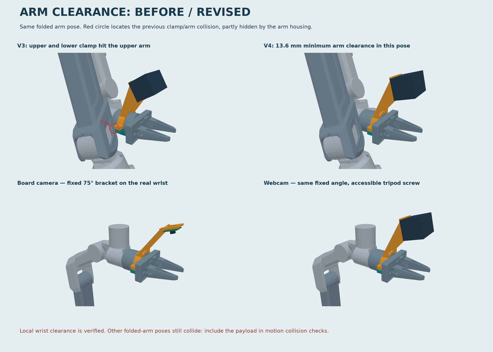

# G1 wrist-camera mount prototypes

**Current design: [revision 4 — fixed 75°](v4/README.md).** Includes board-camera
and tripod-webcam brackets, print-oriented STL files, editable STEP models,
assembled arm previews and additional payload URDF variants.

[Download the v4 prototype bundle](v4/g1_camera_mounts_v4_prototype.zip) ·
[Printing and assembly](v4/README.md#parts-and-assembly) ·
[Arm collision results](v4/README.md#results-including-failures)

These are mechanically untested prototypes. The wrist links clear the modelled
payload, but some folded-arm configurations still collide. Exact camera fit,
optics, payload inertia and training integration remain unfinished; adding these
URDF files does not enable collision avoidance or a wrist-camera training stream.

## Revision history

- [v4](v4/README.md): current fixed 75° prototype with full-arm collision audit.
- [v3](v3/README.md): superseded fixed 60° design; used in the v4 comparison render.
- [v2](v2/README.md): superseded adjustable design.
- [v1](README_v1.md): initial adapters; original files retained in this directory.

Use only `v4/stl/` for the current printable parts. Older files and ZIPs are
retained as design history, not as equally validated alternatives.
