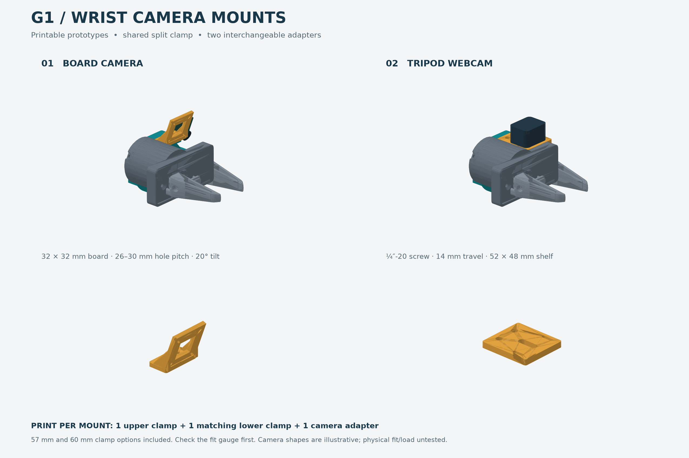

> Historical revision 1. Use [the current index](README.md) for revision 4. This early design is not qualified for unrestricted arm motion.

# G1 wrist-camera mounts — printable prototypes

Two original camera adapters sharing a removable split clamp around the **stationary
cylindrical G1 motor housing**. Neither uses the arm-to-gripper screws. Units: **mm**.
The STLs are already oriented with their intended print face on Z=0.



## What to print

For **one** wrist camera, print **one upper clamp + one lower clamp of the same
diameter + one adapter**. You do not need both camera adapters at once.

| Camera | Adapter | Extra printed parts |
| --- | --- | --- |
| Common SO-101 32 × 32 mm USB board | `stl/so101_32mm_camera_adapter.stl` | Four copies of `stl/m2_camera_spacer_3mm.stl`, or bought insulating spacers |
| Webcam with female ¼″-20 tripod socket | `stl/tripod_webcam_adapter.stl` | None |

Choose either `clamp_upper_60mm.stl` + `clamp_lower_60mm.stl`, or the matching
`57mm` pair. **Measure your actual exposed housing first.** Print the corresponding
`fit_gauge_60mm.stl` or `fit_gauge_57mm.stl` before the full set. These thin open
half-rings are fit checks only, not usable mounts. Their inside diameters are 60.6
and 57.6 mm, including the clamp's clearance allowance. Use them on the bare housing;
they should sit around it with about 0.3 mm radial clearance.

Why two sizes: the [Galaxea hardware specifications](https://docs.galaxea-ai.com/Guide/A1XY/hardware_introduction/A1XY_Hardware_Introduction/)
list a **57 mm motor diameter**, while this repository's `gripper_link.STL` has a
**60 mm outer cylindrical housing** across sections at X = −65, −45 and −25 mm.
The motor specification is not proof of the accessible outside diameter. The **60 mm
set is the CAD-matched starting point**; the 57 mm option is provided only if your
measured housing actually matches it. Do not scale the STL to change diameter;
that would also change camera and fastener holes.

## Interfaces and dimensions

- Clamp: 18 mm axial width, 5 mm radial wall, 1.5 mm gap between halves,
  0.6 mm diametral clearance; use approximately 0.5 mm rubber liner, trimmed to fit.
  Do not force the halves together until the gaps close: grip comes from the liner,
  not from bottoming the ears against each other.
- The two clamp bolts pass through **4.5 mm holes**. Lower ears have M4 hex-nut pockets.
- The shared camera interface has two **3.4 mm holes**, 20 mm apart, on an
  accessible overhanging deck. Nuts are reached from underneath.
- Board adapter: 40 mm outer frame, 20 × 20 mm centre opening. Four diagonal
  **2.4 mm slots** accept a square hole pitch of **26–30 mm** in both directions.
  This is a generic 32 mm board fit, not confirmation of your exact camera model.
  The lens points forward and **20° down**. Four 3 mm insulating spacers lift the
  PCB from the frame; check rear-component and USB-connector clearance.
- Webcam shelf: **52 × 48 × 6 mm**, **6.8 mm-wide slot**, 14 mm screw-centre travel.
  Uses a real metal **¼″-20 screw**, not a printed thread. M3 socket heads sit in
  6.4 mm-diameter, 3.2 mm-deep counterbores below the seating surface.
  Two outer slots accept cable ties. Use the webcam's own tilt joint to aim it;
  the shelf itself has no pitch adjustment.

## Hardware for one mount

| Part | Board camera | Tripod webcam |
| --- | --- | --- |
| Clamp fasteners | 2 × M4×20 socket screws, 2 M4 nuts, 2 head washers | Same |
| Adapter fasteners | 2 × M3×16 socket screws, 2 M3 nuts, thin head washers | 2 × M3×12 socket screws, 2 M3 nuts; heads seat in counterbores |
| Camera fasteners | 4 × M2×12 screws + M2 nuts, 4 × 3 mm insulating spacers; check PCB thickness | 1 × metal ¼″-20 screw + broad washer, length selected for the camera |
| Contact protection | ~0.5 mm rubber sheet, cut into two strips up to 16 mm wide | Same, plus optional thin non-slip pad under webcam |
| Cable management | Small cable ties | Small cable ties |

Use longer board spacers only if needed for rear components, and adjust M2 screw
length accordingly. Do not let hardware contact PCB components or traces.

For the webcam screw, measure the socket depth. Screw length under the head must
equal **6 mm shelf + washer/pad thickness + permitted thread engagement**. A ½″
screw is **not automatically suitable** for every webcam. Check it does not bottom
out in the camera before the camera is secured. A washer must bridge the 6.8 mm slot.

## Printing and assembly

Suggested first prototype: PETG, 0.2 mm layers, 5 perimeters, 5 top/bottom layers,
40–50% infill. These are starting settings, not a strength rating. Small M2 spacers
may be more consistent bought in nylon; if printing, print four solid copies.

Use the supplied STL orientation. Clamp halves stand on their flat axial faces;
the board bracket and webcam shelf sit on their flat bases. Inspect the slicer
preview: large supports should not be necessary, but small horizontal holes and
the nut-pocket roofs may need tuning to your printer's bridging performance.
Clean the holes to nominal clearance if your printer produces undersized holes.

1. Support the arm before disabling it; this arm has no brakes. Work with the
   gripper stationary. See the repository's [safety notes](../../docs/SAFETY.md).
2. Check the fit gauge and confirm at least **18 mm of unobstructed cylindrical
   housing** is available, clear of connectors, fasteners and moving parts.
3. Fit the chosen camera adapter to the upper clamp first; hold its M3 nuts from
   underneath the overhanging deck. Use the listed screw lengths so ends remain
   clear of the housing.
4. Fit the camera and strain-relieve its USB lead to the adapter. Route its cable
   with enough slack for wrist rotation.
5. Put a trimmed liner between the housing and both clamp halves. Seat the M4 nuts
   in the lower pockets and tighten both clamp screws evenly until the mount
   cannot slip by hand. No tightening torque is specified for this untested print.
6. Aim the adapter deck toward the fingers. The preview places the clamp centre
   at **X = −45 mm in the repository's gripper frame**, giving a band from −54 to
   −36 mm. This is a model-based reference, not a measurement from an arbitrary
   outer edge on your hardware.
7. Check the actual camera, all screw tips, cable slack and full jaw travel before
   a slow motion trial. Full-arm clearance and cable routing require checking on
   the physical robot. Recheck clamp slip after the first trial.

## What has and has not been verified

Every supplied STL is one connected closed solid, watertight with consistent
triangle winding and positive volume, with its lowest point on Z=0. See
`validation.json`. CAD checks verify that the clamp halves do not overlap and
that either adapter seats on the shared deck without intersecting it.

The **60 mm set** was also checked at the reference position against conservative
housing/rail envelopes and the full linear jaw sweep derived from the repository's
G1 meshes. There is no intersection of the printed parts with those envelopes.
That check does **not** establish physical fit or validate an arbitrary camera
body, cables, screw stack, all arm poses, vibration, slip, thermal behaviour, or
payload capacity. **These are untested prototypes, not load-rated accessories.**

## Editable source and regeneration

Each part also has a `step/` file in assembly coordinates. `generate.py` is the
parametric source. The design was generated with Python 3.12, CadQuery 2.8.0 and
trimesh 5.1.0; `render_preview.py` additionally uses matplotlib.

```sh
python -m venv .venv
.venv/bin/pip install -r requirements.txt
.venv/bin/python generate.py
.venv/bin/python render_preview.py
```

Run from this folder. CAD construction uses +X toward the fingers, +Z above the
gripper and +Y sideways. Clamp parts centre on the housing axis at X=0; move them
−45 mm in X for the repository gripper. Adapter bases sit at Z=0; translate them
up by `deck_height(d)` (41.3 mm for 60 mm, 39.8 mm for 57 mm) to assemble.
Exported clamp STLs rotate into print orientation; use STEP for assembly.
Geometry generation also works from an extracted standalone bundle. The additional
G1 envelope check and preview regeneration require the repository's robot meshes;
the envelope check reports a skip when those meshes are absent. The included
validation report and preview were generated with the repository meshes available.

Source references inspected on 2026-09-18:

- [Official G1 end STEP](https://github.com/userguide-galaxea/STP/blob/main/A1X/G1_end.STEP):
  checked for geometry, but this is an end/flange component and does not establish
  an accessible camera screw pattern. No vendor geometry is copied into these parts.
- [BEHAVIOR ZED Mini mount](https://github.com/behavior-robot-suite/brs-ctrl/blob/main/hardware/camera_mounts/zed_mini_mount.stl):
  inspected as a reference. These adapters are independently constructed and do
  not redistribute or modify that STL.
- [SO-101 board camera guide](https://github.com/TheRobotStudio/SO-ARM100/blob/main/Optional/Wrist_Cam_Mount_32x32_UVC_Module/README.md):
  source for the 32 × 32 mm module and M2 mounting convention. Hole-pitch adjustment
  is an explicit design allowance, not a measured property of your camera.
