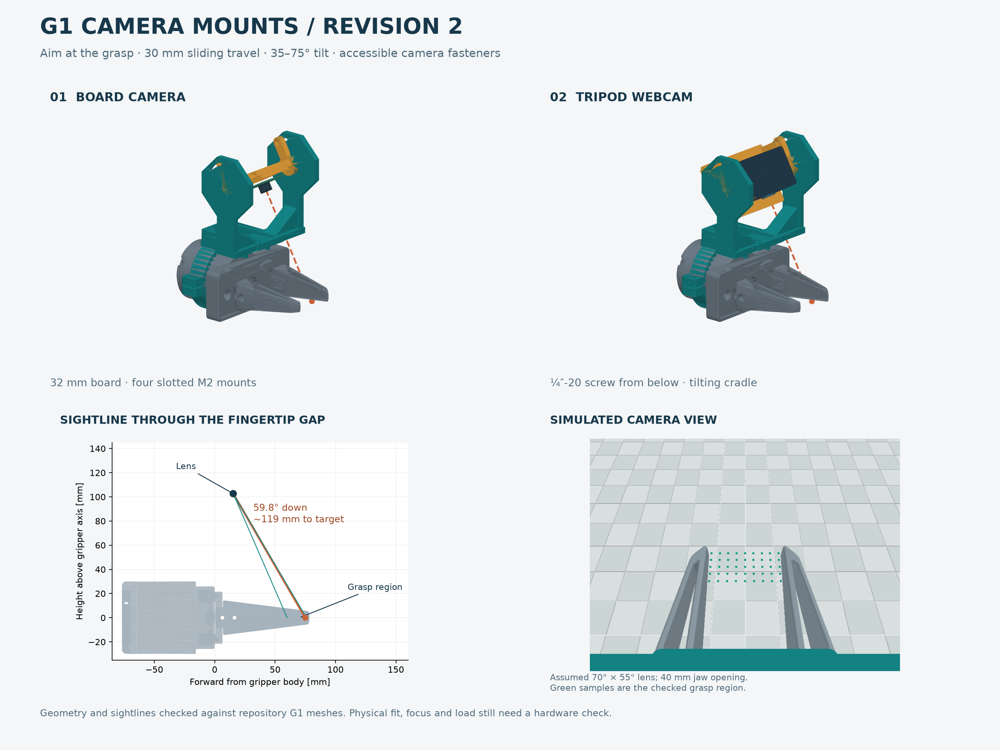

> A simpler **fixed-angle version** is available in [revision 3](../v3/README.md). This folder retains the adjustable design.

# G1 wrist cameras — revision 2

**Use this revision instead of the first fixed-angle mounts.** This design adds a
30 mm sliding boom and a 35–75° tilt joint. The default position aims through the
space between the fingertips. The same fork accepts either the board-camera holder
or the tripod-webcam cradle.



## Print this set

All STL units are **millimetres**. Files are oriented for printing; do not scale.

| Part | Quantity per camera mount |
| --- | --- |
| `clamp_upper_60mm.stl` + `clamp_lower_60mm.stl` | One each, or use the matching 57 mm pair after measuring |
| `sliding_tilt_fork.stl` | One |
| `so101_board_tilt_carrier.stl` **or** `webcam_tilt_carrier.stl` | One, according to camera |
| `m4_hinge_spacer_2mm.stl` | Two |
| `m3_lock_spacer_2mm.stl` | Two |
| `m2_board_spacer_3mm.stl` | Four for the board camera only; bought insulating spacers also work |

There are **four main printed parts** per assembled mount, plus the small spacers.
Print the appropriate **`fit_gauge_60mm.stl` / `fit_gauge_57mm.stl` first**. The
60 mm version matches the cylindrical housing in this repository's G1 mesh. The
57 mm option covers the motor diameter in Galaxea's specifications but is not proof
that the outside of your particular housing is 57 mm. Measure the stationary
housing where the clamp will sit and confirm a clear 18 mm-wide band is available.

The gauges include 0.6 mm diametral clearance: their inner diameters are 60.6 / 57.6
mm. They should loosely fit the bare housing. Full clamps use approximately 0.5 mm
rubber liner, trimmed so it does not overlap, enter the split gaps or cover a port.
Do not squeeze the clamp ears together until they bottom out.

## Camera compatibility — explicit design limits

### SO-101-style board camera

- 32 × 32 mm board; four M2 holes on a **26–30 mm square pitch**.
- Slotted mounting holes; 3 mm insulating spacers behind the PCB.
- The optical calculation assumes a centred lens with its optical centre
  **14.6 mm ahead of the tilt axis**. A different lens protrusion changes working
  distance; use the tilt and slide adjustments with the live feed.
- Rear electronic components and USB connectors must fit the spacer gap and the
  20 × 20 mm frame opening. Taller components require longer spacers and matching
  screws. The actual board model was not supplied, so component fit is not claimed.

### Tripod-ready webcam

- A real female **¼″-20 tripod socket**, with an accessible camera mounting plane.
- The checked camera-body envelope is **45 mm front/back × 74 mm wide × 45 mm high**.
  A webcam with a large hinged monitor clip or an offset base may fall outside it.
- The lens is assumed centred sideways, **10–40 mm above the mounting plane**,
  and **0–32.5 mm forward of the tilt axis in camera coordinates**. If the lens is
  offset sideways, adjust the webcam's yaw and verify the live view; that case has
  not been included in the numerical sightline test.
- The metal tripod screw goes **from below**, through a washer and the cradle's
  6.8 mm slot, into the webcam. The slot provides **20 mm travel**. A 50 mm driver
  approach corridor under this screw was checked against the mount and gripper.
- The cradle itself tilts; a webcam does **not** need its own tilt joint.

### Focus and field of view

The optical checks are geometry checks, not a substitute for the actual lens.
For the full tested opening/position range:

| | Board camera | Webcam envelope cases |
| --- | --- | --- |
| Distance to checked grasp points | 106–138 mm | 86–152 mm |
| Largest minimum horizontal FoV required | 49.1° | 58.9° |
| Largest minimum vertical FoV required | 14.7° | 18.4° |

Allow margin above these minimum FoVs. The preview assumes **70° horizontal × 55°
vertical**; it is a synthetic pinhole view, not a photo or a verified camera spec.
A fixed-focus webcam that cannot focus at these distances is unsuitable in this
configuration. Sliding rearward increases working distance and reduces the FoV
needed. Check focus and visibility with the actual camera before a motion trial.

Some fingers and the bottom edge of the mount can be in frame. The intended clear
region is **between the fingertips**, not an image with the entire robot absent.
An object can also hide its own far contact point. No mount can see an empty gap
when the fingers are fully closed.

## Fasteners and assembly stack

Quantities below are for one complete mount. Do not omit the two sets of printed
2 mm hinge spacers: they keep screw tips out of the camera clearance space.

| Use | Hardware |
| --- | --- |
| Clamp halves | 2 × M4×20 socket screws, 2 M4 hex nuts, 2 M4 head washers |
| Sliding boom | 4 × M4×20 socket screws, 4 M4 hex nuts, 4 M4 head washers, approx. 0.8 mm thick |
| Tilt pivots | 2 × M4×16 socket screws, 2 M4 hex nuts, 2 M4 washers approx. 1 mm thick, 2 printed M4 2 mm spacers |
| Tilt locks in curved slots | 2 × M3×16 socket screws, 2 M3 hex nuts, 2 M3 washers approx. 0.5 mm thick, 2 printed M3 2 mm spacers |
| Board camera | 4 × M2×12 screws, 4 M2 nuts, 4 insulating 3 mm spacers; check actual PCB thickness |
| Webcam | 1 metal ¼″-20 screw and broad washer; thin non-slip pad optional |

Nut pockets allow nominal **7 mm across-flats M4 nuts, 3.2 mm high**, and **5.5 mm
across-flats M3 nuts, 2.4 mm high**. Check your hardware, especially taller nyloc nuts.
The supplied pockets are sized for ordinary hex nuts. Use removable thread-locking
appropriate to the hardware if needed; no torque is specified for these prints.

For the tripod screw, select under-head length as:

**6 mm cradle + washer/pad thickness + camera-permitted thread engagement.**

Do not assume a ½″ screw will fit every webcam: shallow sockets can bottom out.
The broad washer must bridge the slot. The printed cradle has no ¼″ thread.

Tilt fastener stack, **outside → inside**:

**screw head → metal washer → printed 2 mm spacer → fixed fork cheek → 0.3 mm gap
→ moving carrier cheek with captive nut.**

The pivot bolts go through the central round holes. The two M3 locking bolts go
through the curved slots into the nuts in the moving carrier's rear tabs. Loosen
the locks to aim; tighten both locks and pivots to hold the chosen angle. This is
a friction-locked joint, not a geared/indexed mechanism.

## Printing

Suggested first build: **PETG, 0.2 mm layers, 5 perimeters, 5 top/bottom layers,
40–50% infill**. This is a prototype setting, not a certified load rating.

- Clamp halves print on their axial faces, as exported.
- The fork prints with its wide base on the bed. Cheek transitions have 45°
  slopes. Check the slicer around the small horizontal holes and curved slots;
  local support may help your printer.
- **Board carrier: enable support from the build plate under the recessed frame
  and cross-bridge.** Its hinge ends project beyond the camera seating face, so
  simply dropping it face-down does not put the entire frame on the bed. The STL
  orientation accounts for this geometry but does not contain generated supports.
- Webcam cradle prints on its flat underside. Use local support under the side
  window roofs if your printer cannot bridge the 20 mm openings cleanly.
- Print spacers solid; keep holes clear. Deburr holes and remove supports before
  inserting nuts. Do not force screws through blocked support material.

## Assemble and aim

1. Support the arm before disabling it; it has no brakes. Work with the gripper
   stationary. Measure the housing and try the fit gauge.
2. Seat the M4 nuts in the lower clamp pockets. Fit the lined upper and lower
   halves around an unobstructed stationary section of the housing. Leave both
   clamp gaps open and tighten evenly only until the mount cannot slip by hand.
3. Put the fork on the upper deck. Its two long slots run front/back. Insert all
   four M4 boom screws with washers and nuts under the deck. The reinforcement
   ribs have clearance for the nuts; the central opening preserves screwdriver
   access below the webcam at shallow tilt. Leave the screws loose enough to slide.
4. Fit the camera to its moving carrier on the bench. For a board, keep spacers
   and hardware away from components/traces. For a webcam, verify socket depth
   and install the tripod screw from underneath the cradle.
5. Insert the M4 pivot nuts and M3 lock nuts into the moving carrier's **inner**
   pockets. Put the carrier between the fork cheeks, with lens facing the fingers.
   Install pivots and locks using the stacks above; the screw heads are outside.
6. Reference clamp placement in the G1 model: its centre is **45 mm behind the
   front face of the main gripper body**, not behind the fingertip. The collar
   occupies X = −54..−36 mm in the gripper frame. Confirm real ports and fasteners
   leave that band free; the mesh does not establish cable clearance.
7. Starting slide: position the **fork base's rear edge 2 mm forward of the upper
   clamp deck's rear edge**. This corresponds to `slide=8` in the CAD. Starting
   board-camera tilt: **about 60° downward**. The 60 mm clamp then has a hinge
   115.3 mm above the gripper axis and a nominal board-camera optical centre about
   103 mm above it, approximately 119 mm from the grasp centre.
8. With the live camera feed on, put a small target between the fingertips near
   their ends. Slide and tilt until the target is centred and sharp. For a webcam,
   lens height changes the required angle: the cradle is deliberately adjustable.
   Tighten all four boom screws and both tilt locks/pivots, then recheck the view.
9. Strain-relieve the USB cable through the carrier's available openings/slots,
   leaving slack for tilt and wrist rotation. Check the actual camera, fasteners,
   wiring, and full jaw travel before a slow arm trial. Check for slip/vibration
   afterward. No full-arm sweep or load rating has been established.

## Verification included with this revision

- **12 STLs**: valid one-solid CAD, watertight meshes, consistent winding, positive
  volume, minimum printed Z=0 (`mesh_validation.json`).
- **108 sampled mechanical configurations**: both diameters, three slide positions,
  nine tilt angles and two carriers; no unwanted solid intersections. The 60 mm
  parts clear a conservative housing/rail/full-jaw-sweep envelope. The 57 mm set
  is checked internally; a physical 57 mm outer housing was not available.
- **20 webcam-body envelope poses**: two slide extremes, five tilt angles and two
  tripod-slot extremes, checked against the fork and the robot envelope.
- **9,000 sightline segments in 40 cases**, with zero blocked segments to the
  sampled grasp region, using the actual G1 body/finger triangles and printed-part
  geometry. The cases cover both clamp diameters, slide extremes, board camera,
  and nine webcam optical-centre combinations. Jaw openings are 10, 20, 40, 70,
  and 100 mm. Targets cover X=60..76 mm, Z=0 and the gap minus a 2 mm edge margin.
- Nominal fastener envelopes, nut access, boom screw-tip clearance and a tripod
  screwdriver approach corridor are checked (`fastener_validation.json`).

These checks address the earlier visibility and assembly omissions. They do not
establish actual housing fit, printed strength/creep, friction retention, camera
focus, camera internals, connector clearance, distortion or full-arm collision
clearance. **This is a checked CAD prototype awaiting a physical fit test.**

## Editable files and reproduction

`step/` contains editable individual solids plus 60 mm assembled STEP models.
`design.py` is the parametric source. The STEP coordinates retain assembly axes;
clamp STL orientations differ for printing. `verify.py`, `check_fasteners.py`, and
`render.py` reproduce the checks and images.

```sh
python -m venv .venv
.venv/bin/pip install -r requirements.txt
.venv/bin/python design.py
.venv/bin/python check_fasteners.py
.venv/bin/python verify.py
.venv/bin/python render.py
```

Run from this directory. Generation is standalone. Verification/rendering require
the repository's robot meshes at `ros2_ws/src/galaxea_a1xy_description/meshes`;
these vendor robot meshes are not redistributed in the download bundle. Adjust
`REPO` in `design.py` if running the extracted bundle against a separate checkout.
The included validation reports were generated in the repository.

References: the repository G1 URDF/meshes; [Galaxea hardware specifications](https://docs.galaxea-ai.com/Guide/A1XY/hardware_introduction/A1XY_Hardware_Introduction/);
[SO-101 board-camera mounting convention](https://github.com/TheRobotStudio/SO-ARM100/blob/main/Optional/Wrist_Cam_Mount_32x32_UVC_Module/README.md).
All printed parts here are original CAD; no external camera-mount STL is copied.
