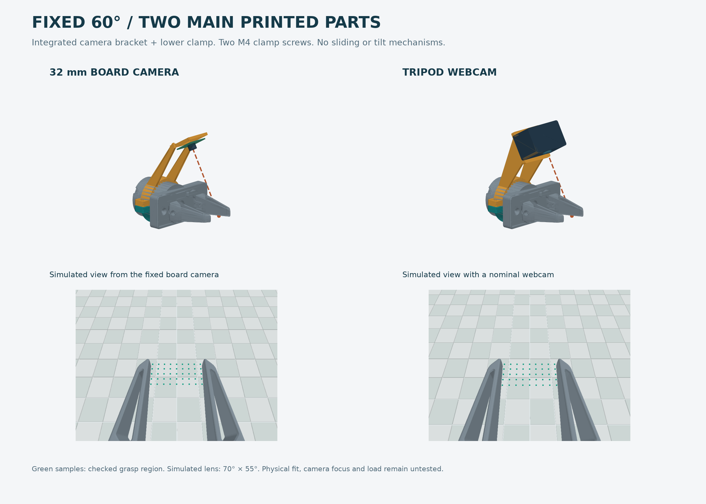

> **Superseded: this design can intersect the upper arm in folded poses. See [revision 4 and the actual-arm collision checks](../v4/README.md).**

# Fixed 60° G1 wrist-camera mounts — revision 3

**Two main printed pieces, two M4 clamp screws, no adjustment mechanism.**
Choose the upper bracket for your camera and the matching lower clamp. Both
brackets point the camera 60° downward toward the fingertip gap.



## What to print

| Camera | Upper bracket | Lower piece |
| --- | --- | --- |
| 32 × 32 mm SO-101-style module | `board_fixed60_upper_60mm.stl` | `lower_clamp_60mm.stl` |
| Webcam with ¼″-20 socket | `webcam_fixed60_upper_60mm.stl` | `lower_clamp_60mm.stl` |

**Measure the housing and print `fit_gauge_60mm.stl` first.** The 60 mm size matches
the outside diameter in the repository G1 model. A 57 mm set is also provided if
that is your measured housing diameter. Do not scale STLs to change size. Units
are millimetres. Gauges have 0.6 mm diametral clearance; they are not mounting parts.

The lower clamp has the same geometry as revision 2 and can be reused in the same
size. The upper brackets replace the clamp deck, boom and camera holder entirely.
For the board camera, print four `m2_spacer_3mm.stl` spacers or use bought insulating
3 mm spacers. No other printed parts are needed.

## Fasteners

For either mount:

- **2 × M4×20 socket screws, 2 ordinary M4 nuts, 2 M4 head washers** for the clamp.
- Approximately **0.5 mm rubber liner** between clamp and stationary motor housing,
  trimmed without overlaps. Tighten evenly until it cannot slip by hand; do not
  force the two split gaps closed. An 18 mm-wide unobstructed band is required.

For the board camera:

- **4 × M2×12 screws and nuts**, plus four 3 mm insulating spacers.
- Four slots accept a **26–30 mm square hole pattern** on a 32 × 32 mm board.
- Confirm the rear components/connector clear the frame and spacers. The exact
  camera model was not supplied, so component-level fit is not established.

For the webcam:

- **One real ¼″-20 screw and broad washer**, inserted **from below** through the
  single 6.8 mm hole into the camera. There are no printed threads.
- Screw under-head length = **6 mm printed plate + washer/pad thickness + camera's
  permitted thread engagement**. Measure the socket; a screw must not bottom out.
- A thin non-slip pad under the camera helps resist rotation. The webcam must be
  oriented with its optical axis parallel to the plate and toward the fingers.
- The plate is **50 × 54 mm**. Checked camera envelope: **45 mm front/back × 74 mm
  wide × 45 mm high**, centred on the mounting screw, excluding a bulky monitor clip.

## View and mounting position

Place the clamp centre **45 mm behind the front face of the main gripper body**
(not behind the fingertips), with the upper bracket above the gripper and the lens
facing forward. The reference model's clamp band is X=−54..−36 mm. Check actual
connectors, existing fasteners and cables before fitting it there.

The board design's nominal optical centre is approximately **(20.8, 0, 93.9) mm**
in the gripper frame for the 60 mm set. At 60° down, its centre ray reaches the
fingertip region near **X=75 mm, Z=0**. It is roughly **108 mm from that target**.

The webcam platform is also fixed at 60°. A webcam whose lens is 24 mm above the
mounting plane aims at the same target. Different lens heights change framing;
there is deliberately no mechanism to correct that angle. The supplied checks
cover centred lenses **10–40 mm above the mounting plane** and **0–22.5 mm forward
of the socket**. Those cases keep the sampled grasp region unobstructed, but move
it within the image. A lens offset sideways has not been tested.

| Optical requirement across checked cases | Board | Webcam |
| --- | --- | --- |
| Focus distance to sampled grasp points | 100–119 mm | 92–134 mm |
| Minimum horizontal field of view needed | 51.5° | 55.3° |
| Minimum vertical field of view needed | 14.7° | 34.7° |

Allow margin above these FoVs. The preview assumes a **70° × 55° pinhole camera**;
it is not a photo or a statement about your actual lens. A webcam that cannot focus
at roughly 10 cm may not suit this mount. Verify the live image before moving the
arm. Fingers will appear in frame; the checked region is the gap between them.

## Printing and assembly

Starting settings: PETG, 0.2 mm layers, 5 perimeters, 5 top/bottom layers, 40–50%
infill. These are prototype settings, not a load rating.

**The integrated upper brackets require supports.** They are exported sideways so
layers run along the supporting ribs. Use build-plate supports under the elevated
rib, camera plate/frame and clamp arc; inspect the slicer preview rather than
assuming the shape is support-free. Remove supports completely from the clamp bore
and camera holes. Lower clamps print on an axial face; spacers print flat and solid.

1. Support the arm before disabling it; it has no brakes. Work with the gripper
   stationary. Measure the housing and try the fit gauge.
2. Install the camera on the upper bracket. Fit M2 spacers behind the PCB, or put
   the tripod screw and washer through the webcam plate from below.
3. Seat the M4 nuts in the lower clamp's hex pockets. Fit liner and clamp halves
   around the unobstructed housing band. Install the two M4 screws from above.
4. Aim the entire bracket forward over the fingers and tighten the clamp evenly.
   There is no sliding rail or pitch joint to assemble or adjust.
5. Strain-relieve the USB cable to a fixed rib with a cable tie, leaving enough
   slack for wrist rotation. Check live view, focus, fastener tips, connectors and
   full jaw travel before a slow motion trial; recheck grip/slip afterward.

## Verification and limits

- Nine supplied STLs: one valid CAD solid per part, watertight meshes, consistent
  winding and positive volume. Print orientations are included.
- Both camera brackets and both clamp sizes checked for internal interference,
  clamp screw access, and nut clearance. The 60 mm pair clears conservative G1
  housing and full-jaw-sweep envelopes derived from the repository meshes.
- Camera PCB/nut envelopes, the stated webcam envelope, tripod washer and a 50 mm
  screwdriver corridor checked for solid intersections.
- **4,500 sampled sightlines, zero blocked**: both diameters, nominal board camera,
  nine webcam optical-centre combinations, and 10/20/40/70/100 mm jaw openings.
  The sampled gap is X=60..76 mm, Z=0, with a 2 mm margin from each jaw.

See `mesh_validation.json` and `validation.json`. These are geometric checks of
fixed-angle prototypes, not physical validation of fit, strength, creep, clamp
friction, exact optics or cable routing. Closed fingers and objects can hide parts
of the contact area. No full-arm workspace collision check has been performed.

## Editable CAD

`step/` includes individual parts and assembled 60 mm models. `design.py` generates
the CAD/STLs. `verify.py` and `render.py` reproduce the checks and previews.

```sh
python -m venv .venv
.venv/bin/pip install -r requirements.txt
.venv/bin/python design.py
.venv/bin/python verify.py
.venv/bin/python render.py
```

Generation works standalone. Verification/rendering need the repository G1 meshes;
set `REPO` in `design.py` to your checkout if using the extracted download. Those
vendor meshes are not redistributed in this bundle. CAD uses +X toward the tips,
+Z above the gripper; STEP retains assembly coordinates and STL is print-oriented.
